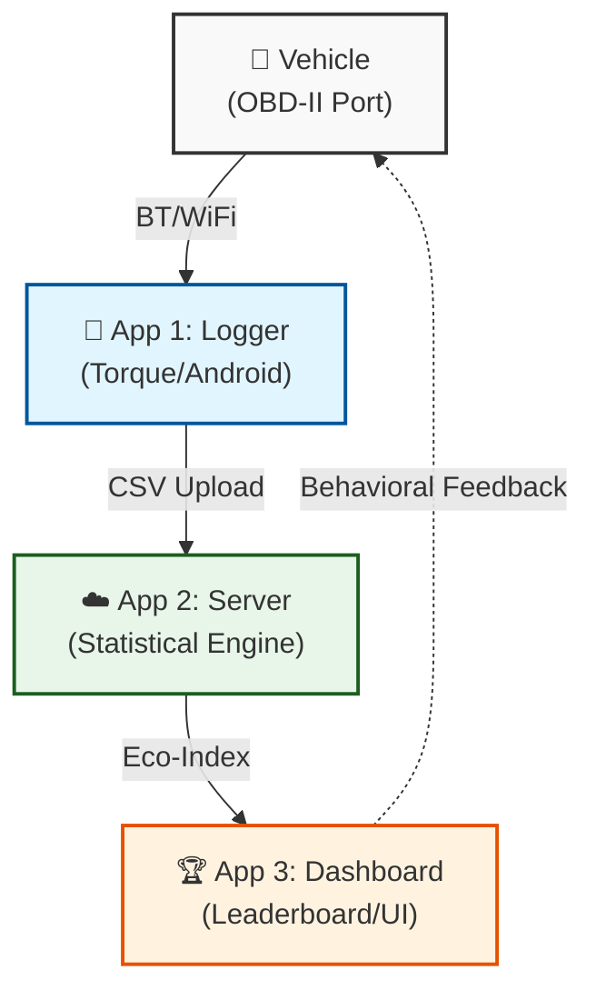

# Fuel EKO Wars: Gamified Telematics for Eco-Driving

This is a repository for the collection of drive cycles with E. Tzirakis. 


> **Project Status:** 🛠️ Prototype Phase / Conceptual Architecture
> **Primary Goal:** Transform raw OBD-II data into a competitive "Eco-Index" to incentivize defensive driving and reduce fuel consumption by up to 20%.

---

## 🏎️ Project Overview

**Fuel EKO Wars** is a comprehensive hardware-software ecosystem designed to bridge the gap between mechanical vehicle performance and human driver behavior. While modern vehicles often provide real-time fuel economy feedback, older vehicles lack these insights, and most systems fail to provide the social motivation necessary for long-term behavior change. This project addresses that "motivation gap" by gamifying the driving experience.

The system functions as a closed-loop feedback mechanism:
1.  **Data Acquisition:** High-frequency telematics (RPM, Speed, Throttle, Fuel Rate) are pulled from the vehicle via an **OBD-II (ELM327)** interface.
2.  **Edge Processing:** An Android device (initially using the **Torque** app) acts as a gateway, logging drive cycles and syncing them with user-inputted refueling data and vehicle specs.
3.  **Cloud Analytics:** A centralized server processes these logs to calculate an **Eco-Index**—a weighted metric comparing the user against factory benchmarks (**NEDC/WLTP**) and the community mean.
4.  **Gamified Feedback:** Users receive rankings, "Fuel Vouchers," and psychological nudges ("Loss Aversion" messages) via a dedicated UI to encourage smoother, safer, and more efficient driving.

## 🛠️ The Engineering Logic

As a Mechanical Engineering project, the focus extends beyond simple "average MPG". We are building a database capable of **Drive Cycle Synthesis**. By recording "Real-World" data, the project aims to help academic and research institutions (like NTUA/ETeKL) create more accurate emissions and consumption models that reflect actual Greek or European road conditions rather than idealized lab cycles.

### Core Evaluation Pillars:
* **Behavioral Analysis:** Monitoring throttle position ("The Egg under the Pedal" theory), aggressive acceleration/deceleration, and excessive idling.
* **Performance Benchmarking:** Real-time deviation from **NEDC/WLTP** standards.
* **Environmental Impact:** Direct calculation of $CO_2$ footprint reduction.

---

## 📊 System Architecture & Data Flow



---

## 📈 Current Project Status (Internal Log)

| Component | Status | Notes |
| :--- | :--- | :--- |
| **Hardware** | ✅ Verified | Standard ELM327 (WiFi/BT) is sufficient. |
| **Data Logging** | ⚠️ Testing | Currently manual via Torque; needs automation. |
| **Drive Cycle Pipeline** | ✅ Active | `src/drive_cycle_calculator/` — two-stage archive + analysis pipeline. |
| **Local DB** | ✅ Active | DuckDB catalog (`data/metadata.duckdb`) + v2 archive Parquets. |
| **Cloud DB** | 🏗️ Planned | Supabase/PostgreSQL migration scripted but not deployed. |
| **Gamification** | 💡 Conceptual | "Loss Aversion" messaging and reward tiers defined. |
| **Partnerships** | 🔍 Exploring | Looking at EKO, NTUA, and TEI Crete for scaling. |

---

## 💻 Software

The `src/drive_cycle_calculator/` Python package implements the data pipeline:

```
Raw OBD xlsx/csv
  → dcc config-init <folder>              # generate metadata-<folder>.yaml template
  [user fills in metadata-<folder>.yaml]
  → dcc ingest <raw_dir> <out_dir>        # archive to <out_dir>/trips/*.parquet
                                          # embeds UserMetadata + GPS stats in each file
  → dcc extract <data_dir>               # parquets → trip_metrics (DuckDB / CSV / XLSX)
  → dcc analyze <data_dir>               # similarity scores + representative trip
```

**CLI reference:**

| Command | Description |
|---------|-------------|
| `dcc config-init <folder>` | Write `metadata-<folder>.yaml` template |
| `dcc ingest <raw_dir> <out_dir>` | Raw xlsx/csv → v2 archive Parquets (no DuckDB) |
| `dcc extract <data_dir>` | Archive Parquets → `trip_metrics` DuckDB/CSV/XLSX |
| `dcc analyze <data_dir>` | Similarity analysis from `metrics.duckdb` |
| `dcc gui` | Launch the tkinter GUI |

See `CLAUDE.md` for developer guidance, `TODOS.md` for the backlog, and
`docs/designs/obd-file-processing-config.md` for the full pipeline design.

---

## 🚩 Things to Clarify (Proactive Review)

* **Automation Loop (Slide 20):** Currently, Torque requires a manual export of CSV files. For a viable "game," this must be replaced with a background service or a custom-built logger in App 3 to ensure zero-friction data uploads.
* **Incentive Verification (Slide 15):** If rewards are tied to specific fuel brands (e.g., EKO), how do we verify the user actually filled up there? (e.g., OCR for receipts or QR codes).
* **Correction on "Penalty":** The presentation mentions "User Burden" (Επιβάρυνση). I have interpreted this as **Psychological Loss Aversion** (messages about missed rewards) rather than financial penalties, as the latter would likely alienate users.
* **Obsolete Standards:** The slides focus on **NEDC**. For a 2026 deployment, the backend must prioritize **WLTP** values for vehicle benchmarking to maintain scientific accuracy.

---

#FuelEkoWars #Telematics #EcoDriving #MechanicalEngineering #Obsidian #DriveCycles #Sustainability
