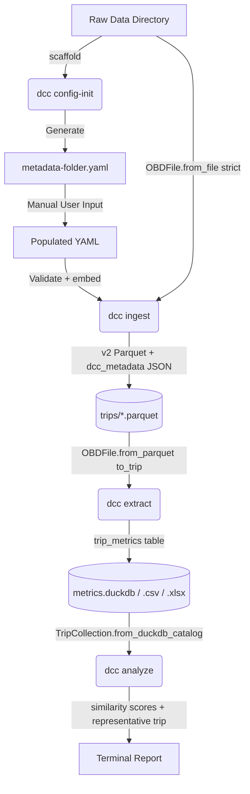

#Project/DataIngestion #Python/CLI #Architecture/DesignSpec

> **Implementation status (2026-04-19):** The pipeline described here has been fully implemented as part of the v0.3 refactor (shipped as package v0.1.0). Several design decisions evolved during implementation — sections marked **[Implemented as]** record the as-built state. `config-verify` was not built; its function is covered by Pydantic validation inside `ingest`. A new `extract` subcommand was added to decouple metric computation from raw archiving.

# Design Specification: Data Ingestion CLI Pipeline

## 1. System Overview
A Python-based Command Line Interface (CLI) application for the standardized ingestion, validation, and transformation of experimental drive cycle data (e.g., WLTP). The system decouples parsing logic from the data itself, ensuring traceability and clean ingestion from heterogeneous tabular sources (`.csv`, `.xlsx`) into a highly performant persistent storage format (Parquet — DuckDB).

## 2. Core Architecture
The architecture relies on a declarative configuration file and a versioned Single Source of Truth (SSOT) for metadata.
* **Configuration Format:** YAML is utilized for human readability and inline documentation.
* **Metadata Validation:** `pydantic` is employed to define and validate versioned metadata schemas.
* **Data Processing:** `pandas` handles ingestion and type coercion; DuckDB handles analytical output from pre-archived Parquets (produced by `dcc extract`, not `dcc ingest`).

## 3. Component Specifications

### 3.1. Single Source of Truth (SSOT) Schema
**[Implemented as]** `schema.py` — `UserMetadata` Pydantic model with fields: `fuel_type` (`FuelType` enum: petrol, diesel, e10, e85, hybrid, electric, lpg, other), `vehicle_category` (`VehicleCategory` enum: sedan, suv, hatchback, van, truck, motorcycle, other), `user`, `vehicle_make`, `vehicle_model`, `engine_size_cc`, `year`, `misc`. Schema version is embedded in every archive Parquet via `ParquetMetadata.schema_version`.

### 3.2. CLI Subcommands

#### 3.2.1. Configuration Initialization (`config-init`)
A subcommand designated to scaffold the ingestion environment.
* **Input:** Target directory path.
* **Execution:**
    1. `UserMetadata` Pydantic model fields and field descriptions are enumerated.
    2. A YAML template is generated via `generate_yaml_template(UserMetadata)`.
* **Output:** `metadata-<folder>.yaml` written into the target directory, containing:
  * `null`-valued placeholders for all `UserMetadata` fields, each preceded by a `#`-comment from the field description.
  * An `# --- Ingest settings ---` block with `sep: null` and `decimal: null` for CSV override.
* **[Implemented as]** `dcc config-init <folder> [--force]`. Output file: `<folder>/metadata-<folder>.yaml`. No file scanning; template is purely schema-driven. `--force` overwrites an existing file.

#### 3.2.2. Configuration Verification (`config-verify`)
**[Not implemented]** This subcommand was removed from the design. Column validation is handled implicitly by `OBDFile` during `dcc ingest` (strict mode raises `ValueError` on missing `CURATED_COLS`). Pydantic validation of the YAML is performed at the start of `dcc ingest` via `UserMetadata.model_validate()`.

#### 3.2.3. Data Ingestion (`ingest`)
The primary command for archiving raw OBD files as self-contained Parquets.
* **Input:** Raw directory, output directory, optional `metadata-<folder>.yaml`.
* **Execution:**
    1. `metadata-<folder>.yaml` is discovered (glob `metadata-*.yaml`) and validated via `UserMetadata.model_validate()`. `sep`/`decimal` ingest settings are popped before passing to Pydantic.
    2. Raw `.xlsx` / `.csv` / `.xls` files are scanned.
    3. Each file is loaded via `OBDFile.from_file()` in strict mode — raises `ValueError` on missing `CURATED_COLS`.
    4. `OBDFile.to_parquet(dest, user_metadata)` writes a v2 archive Parquet with embedded `ParquetMetadata` JSON (`UserMetadata`, `IngestProvenance`, `ComputedTripStats`) under the PyArrow key `dcc_metadata`.
    5. The canonical output filename is `obd.parquet_name` (`t<YYYYMMDD-hhmmss>-<duration_s>-<hash6>.parquet`).
* **Output:** v2 archive Parquets written to `<out_dir>/trips/`. No DuckDB is created here.
* **[Implemented as]** `dcc ingest <raw_dir> <out_dir> [--format auto|xlsx|csv] [--sep SEP] [--decimal DEC]`. CLI `--sep`/`--decimal` override YAML values; both override `OBDFile` auto-detection.

#### 3.2.4. Metrics Extraction (`extract`) — NEW
A subcommand added during implementation to decouple archiving from metric computation.
* **Input:** `<data_dir>` containing a `trips/` sub-folder of v2 archive Parquets.
* **Execution:**
    1. `ParquetMetadata` is read from each Parquet's PyArrow schema metadata — no column data loaded for the filter pass.
    2. Optional date filters (`--from`, `--to`) and GPS centroid filters (`--lat-min/max`, `--lon-min/max`) are applied.
    3. Matching Parquets are loaded via `OBDFile.from_parquet()` → `to_trip(config)`.
    4. `Trip.metrics` (7 keys) + `UserMetadata` fields + GPS stats are assembled into a flat row.
    5. `config_hash` and `config_snapshot` are stored alongside metrics.
* **Output:** `trip_metrics` table in DuckDB / CSV / XLSX written to `<data_dir>/metrics.<ext>`.
* **[Implemented as]** `dcc extract <data_dir> [-o duckdb|csv|xlsx] [--out-file PATH] [--window W] [--stop-threshold T] [--from DATE] [--to DATE] [--lat-min F] [--lat-max F] [--lon-min F] [--lon-max F]`.

#### 3.2.5. Analysis (`analyze`)
* **Input:** `<data_dir>` containing `metrics.duckdb`.
* **Execution:** Loads all trips via `TripCollection.from_duckdb_catalog()`, computes 7-metric similarity scores, identifies the representative trip.
* **Output:** Terminal report of similarity scores (sorted descending) and representative trip stats (mean speed, max speed, stop %, duration).
* **[Implemented as]** `dcc analyze <data_dir>`.

## 4. Pipeline Workflow

