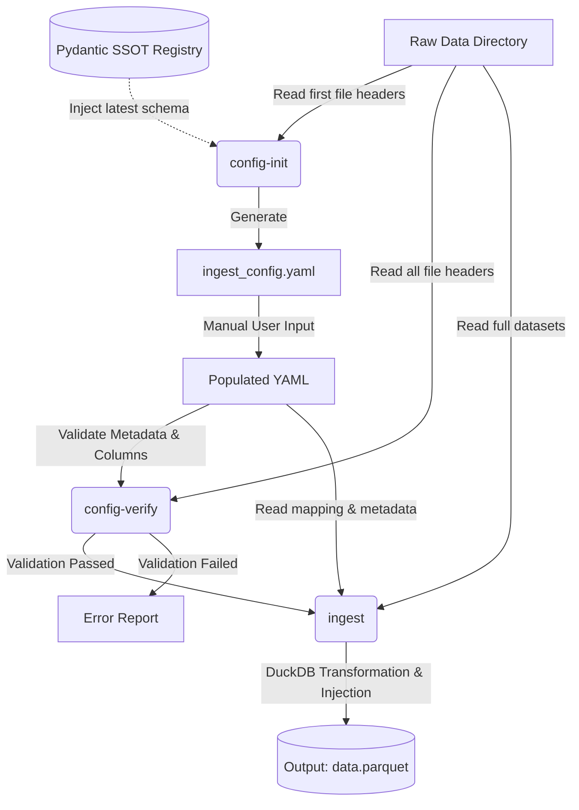

#Project/DataIngestion #Python/CLI #Architecture/DesignSpec

# Design Specification: Data Ingestion CLI Pipeline

## 1. System Overview
A Python-based Command Line Interface (CLI) application is to be developed for the standardized ingestion, validation, and transformation of experimental drive cycle data (e.g., WLTP). The system aims to decouple parsing logic from the data itself, ensuring traceability and clean ingestion from heterogeneous tabular sources (`.csv`, `.xlsx`) into a highly performant persistent storage format (Parquet -  DuckDB).

## 2. Core Architecture
The architecture relies on a declarative configuration file and a versioned Single Source of Truth (SSOT) for metadata.
* **Configuration Format:** YAML is utilized for human readability and inline documentation.
* **Metadata Validation:** `pydantic` is employed to define and validate versioned metadata schemas.
* **Data Processing:** `pandas` (or equivalent) is used for lightweight header extraction, while `duckdb` handles heavy data transformation, metadata injection, and Parquet serialization.

## 3. Component Specifications

### 3.1. Single Source of Truth (SSOT) Schema
A versioned schema registry is implemented to manage contextual test data (e.g., operator, vehicle type, test standard).
* Metadata fields are defined as strictly typed Pydantic models.
* A schema version identifier is mandated to ensure backward compatibility as test requirements evolve.

### 3.2. CLI Subcommands

#### 3.2.1. Configuration Initialization (`config-init`)
A subcommand designated to scaffold the ingestion environment.
* **Input:** Target directory path.
* **Execution:** 1. The directory is scanned for the first valid `.csv` or `.xlsx` file.
    2. File headers are extracted without loading the full dataset into memory.
    3. The latest metadata schema is fetched from the SSOT registry.
* **Output:** An `ingest_config.yaml` template is generated, containing auto-populated column mappings and placeholder fields for required metadata, accompanied by instructional comments derived from the schema definitions. 

#### 3.2.2. Configuration Verification (`config-verify`)
A subcommand utilized as a quality gatekeeper prior to heavy data processing.
* **Input:** Target directory path and configuration file.
* **Execution:**
    1. The `schema_version` is read from the YAML file, and the metadata payload is strictly validated against the corresponding Pydantic model.
    2. Expected source columns are extracted from the YAML mapping.
    3. A set comparison is performed iteratively against the headers of all target files within the directory.
* **Output:** A terminal report is generated, detailing schema validation status and highlighting any specific files that exhibit missing or mismatched columns.

#### 3.2.3. Data Ingestion (`ingest`)
The primary execution command for data transformation.
* **Input:** Target directory path and verified configuration file.
* **Execution:**
    1. Validated metadata values are extracted.
    2. A DuckDB connection is established.
    3. Data is read efficiently using DuckDB's native CSV/Excel scanners.
    4. Target column names are renamed according to the configuration mapping.
    5. Extracted metadata values are injected dynamically as literal/constant columns into the SQL `SELECT` statement, broadcasting the context across all time-series rows.
* **Output:** A consolidated `.parquet` file is written to disk, optimized for subsequent analytical workloads.

## 4. Pipeline Workflow

