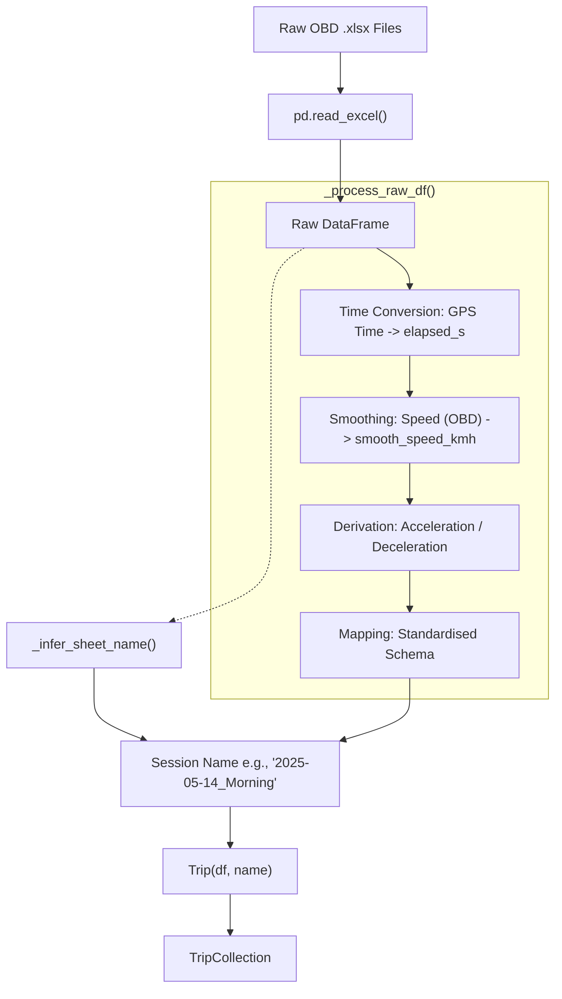

# Trip and TripCollection Usage

The `Trip` and `TripCollection` classes serve as the core domain objects for eco-driving analysis within this module. 

## Core Concepts

- **`Trip`**: Represents a single recorded driving session. It acts as a wrapper around an already processed `pandas.DataFrame` and provides cached properties for extracting specific metrics (e.g., duration, mean speed, mean acceleration, stop percentage) and plotting data (e.g., smoothed speed profiles).
- **`TripCollection`**: Represents a set of these driving sessions. It handles batch-loading, aggregating data, computing similarity scores across trips, and saving/loading datasets for further research.

## Instantiating a `TripCollection`

Depending on the source of your data, there are several constructors available on `TripCollection`:

1. **`TripCollection.from_folder(path)`**: Used when you have a folder full of raw `OBD .xlsx` files exported directly from the Torque app. This reads each raw file in the directory, completely processes it into a unified format, and initializes the internal `Trip` objects.
2. **`TripCollection.from_excel(path)`**: Used when loading an already compiled "calculations log" (a single `.xlsx` file with one sheet per trip) that has already undergone the data processing pipeline.
3. **`TripCollection([trip1, trip2, …])`**: Directly initializes a collection from a standard Python list of pre-existing `Trip` objects.

## Data Processing and Smoothing Pipeline

To answer your question directly: **smoothing always occurs *prior* to the initialization of the `Trip` object**. `Trip` itself assumes it is given a fully cleaned and structured dataframe.

Here is exactly what happens linearly when you call `TripCollection.from_folder(folder_path)`:

1. **Iteration**: The method iterates over all `*.xlsx` files in the provided folder directory.
2. **Raw Loading**: It loads the raw data into a basic `pandas.DataFrame`.
3. **Processing via `_process_raw_df()`**: The raw DataFrame is immediately handed to the internal `_process_raw_df()` function which structurally applies the following:
   - **Time Conversion**: Converts raw `GPS Time` strings into normalized elapsed seconds (`elapsed_s`).
   - **Smoothing (`_smooth_and_derive()`)**: Applies a 4-sample centered rolling average to the `Speed (OBD)(km/h)` column to create `smooth_speed_kmh`.
   - **Derivation**: Derives calculated columns like acceleration (`acceleration_ms2`) and deceleration (`deceleration_ms2`) strictly from the generated smoothed speed.
   - **Mapping**: Formats everything into a standard, clean DataFrame with unified English column headers.
4. **Name Inference**: Uses `_infer_sheet_name` on the raw DataFrame to extract the first valid `GPS Time` cell, generating a max-31-character session name like `2025-05-14_Morning`.
5. **Trip Initialization**: Finally, the *already smoothed/processed* DataFrame and the *inferred name* are passed into the `Trip(df, name)` constructor. 

By applying smoothing prior to `Trip` instantiation, the system ensures that any downstream metric calculations (like those lazily evaluated and cached on the `Trip.metrics` property) operate consistently against unified tabular data without recomputing smoothing.

## Exporting & Data Persistence

The `TripCollection` also includes ways to persist and quickly query the calculated datasets without sequentially processing large flat files:

- **`.to_parquet(dir)` and `.from_parquet(dir)`**: Export/load every processed `Trip` in the collection into optimized columnar parquet files (`{trip_name}.parquet`).
- **`.to_duckdb_catalog(db_path)`**: Backs the metadata of all trips to a low-overhead DuckDB catalog for instant querying, allowing lazily loaded sets via **`.from_duckdb_catalog()`** where the dataframe isn't read until `.metrics` or `.speed_profile` is accessed.
