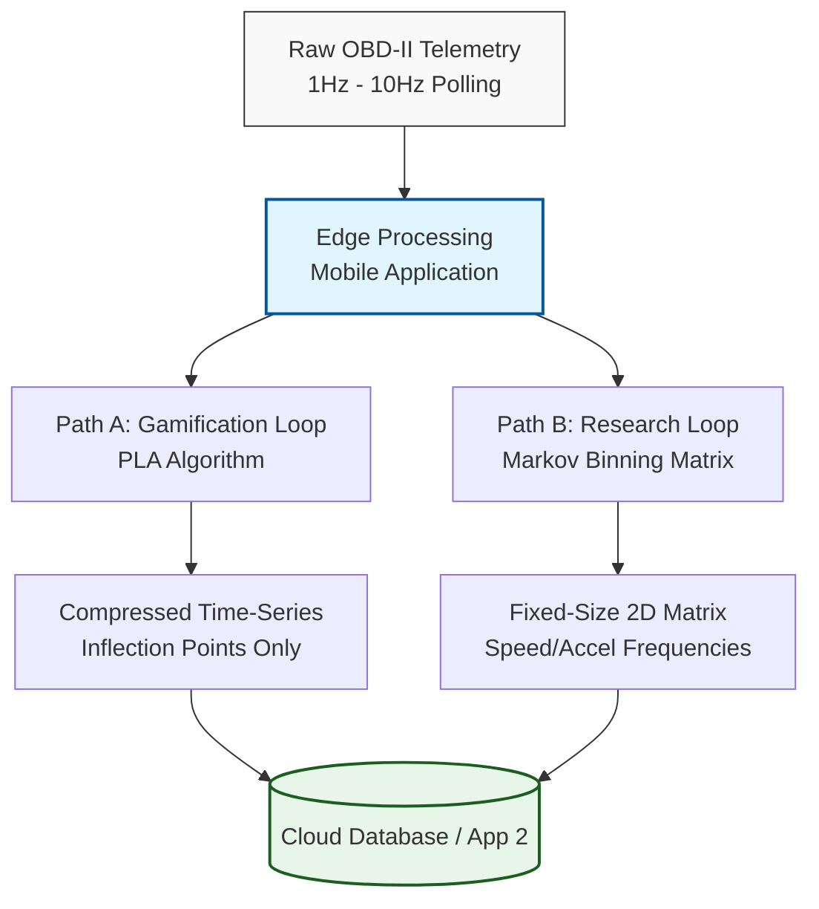

# Telematics Data Reduction & Fingerprinting Methodologies

**Tags:** `#Telematics` `#DataReduction` `#SignalProcessing` `#EcoDriving` `#SystemArchitecture` `#ArchitectureDecisionRecord`

---

## 1. Problem Statement: Data Bloat vs. Information Loss
The acquisition of telematics data via OBD-II (ELM327) operates on a request-response (polling) protocol, yielding instantaneous values at variable frequencies (typically 1Hz to 10Hz). Transmitting and storing raw time-series data for extended drive cycles introduces severe data bloat, straining cellular bandwidth and database storage. Conversely, transmitting only trip averages (e.g., mean speed) strips out the high-frequency behavioral anomalies (aggressive acceleration, hard braking) required for accurate Eco-Driving gamification and research. 

A data reduction methodology (fingerprinting) must be implemented at the edge (the mobile application) to compress the time-history before server transmission.

---

## 2. Proposed Methodologies

### 2.1. Speed-Acceleration Probability Density (Markov Binning)
This approach transforms the time-domain data into a state-frequency matrix. Rather than recording the timestamp of every event, the algorithm records the frequency of occurrence within specific operational states.

* **Mechanism:** A 2D matrix is established with Speed on the X-axis and Acceleration on the Y-axis. At each polling interval, the current speed and acceleration are calculated, and the corresponding matrix bin counter is incremented by one.
* **Optimization Requirement:** The use of non-equispaced bins must be explored. Vehicle dynamics and driver behavior are non-linear; higher resolution bins are required at critical transition zones (e.g., 0-30 km/h acceleration phases) compared to steady-state highway cruising (e.g., 100-120 km/h).
* **Output:** A fixed-size matrix representing the statistical fingerprint of the drive, regardless of the trip's duration.

### 2.2. Wavelet Transform (Time-Frequency Feature Extraction)
Wavelet analysis is highly effective for non-stationary signals, such as sudden braking or rapid gear shifts, where traditional Fast Fourier Transforms (FFT) fall short.

* **Mechanism:** A Discrete Wavelet Transform (DWT) is applied to the raw time history. Low-frequency coefficients (representing steady cruising) are discarded.
* **Output:** Only high-amplitude, high-frequency coefficients are retained and transmitted, effectively isolating the exact moments and magnitudes of aggressive driving behavior.

### 2.3. Piecewise Linear Approximation (PLA)
PLA algorithms (such as Ramer-Douglas-Peucker) reduce the number of points in a curve while preserving its essential shape.

* **Mechanism:** A vector is drawn from the start to the end of a data segment. If intermediate recorded points do not deviate from this vector by a predefined threshold (e.g., $\epsilon = 2\%$), the intermediate points are discarded.
* **Output:** A highly compressed time-series array containing only the critical inflection points of the drive cycle.

---

## 3. Visual Representation of Reduction Flow

