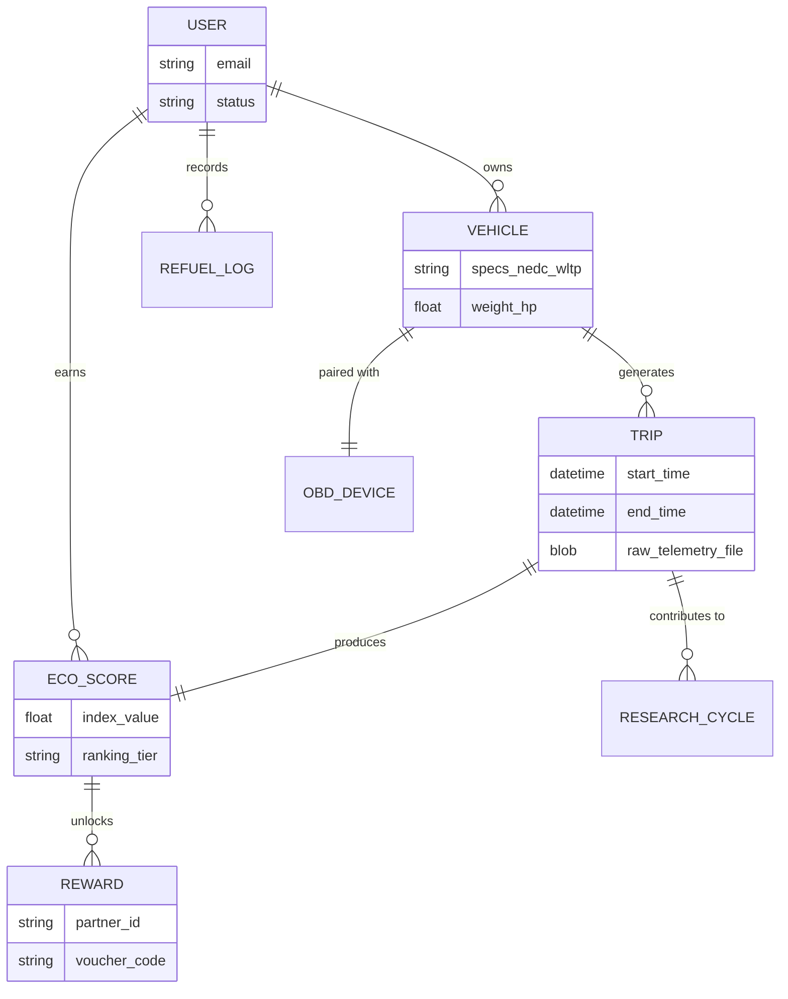

# Data Schema: Fuel EKO Wars Architecture

> **Note for Obsidian Users:** This schema is designed for a knowledge base tutorial on setting up a telematics workflow.
> **Tags:** #ProjectManagement #DataSchema #Telematics #EcoDriving #SoftwareArchitecture #ERD

## 1. High-Level Entity Relationship Diagram (ERD)

This diagram illustrates the core interactions between the driver, the hardware, and the analytical backend.

---

## 2. Core Entity Descriptions

| Entity | Purpose | Source Reference |
| :--- | :--- | :--- |
| **User** | Authentication and profile management. Tracks the "Driver Persona" (age, email). | |
| **Vehicle** | Stores mechanical benchmarks (NEDC/WLTP, Weight, HP) used as a baseline for "performance deviation." | |
| **OBD_Device** | Tracks the specific hardware (ELM327) linked to a vehicle to ensure data integrity. | |
| **Trip** | The container for drive cycle data. Stores start/end points and references the raw sensor logs (Speed, RPM, $CO_2$). | |
| **Refuel_Log** | Manual ground-truth data (Quantity, Price, Brand) used to validate the OBD-calculated consumption. | |
| **Eco_Score** | The analytical output. Stores the calculated "Eco-Index" based on throttle behavior and peer comparison. | |
| **Reward** | The gamification engine. Links specific score thresholds to partner products (EKO fuel, lubricants, etc.). | |
| **Research_Cycle** | Aggregated, anonymized data segments used for scientific modeling of real-world driving cycles. | |

## 3. Critical Data Interaction Flow

1.  **Ingestion:** The **Trip** entity receives a CSV file from the mobile app (App 1/Torque).
2.  **Validation:** The system compares **Trip** consumption data against the **Refuel_Log** to ensure sensor accuracy.
3.  **Scoring:** The Statistical Engine (App 2) compares **Trip** parameters against **Vehicle** (NEDC) and **User** history to generate an **Eco_Score**.
4.  **Feedback:** The **Eco_Score** updates the User's ranking and triggers **Reward** availability in the UI (App 3).

