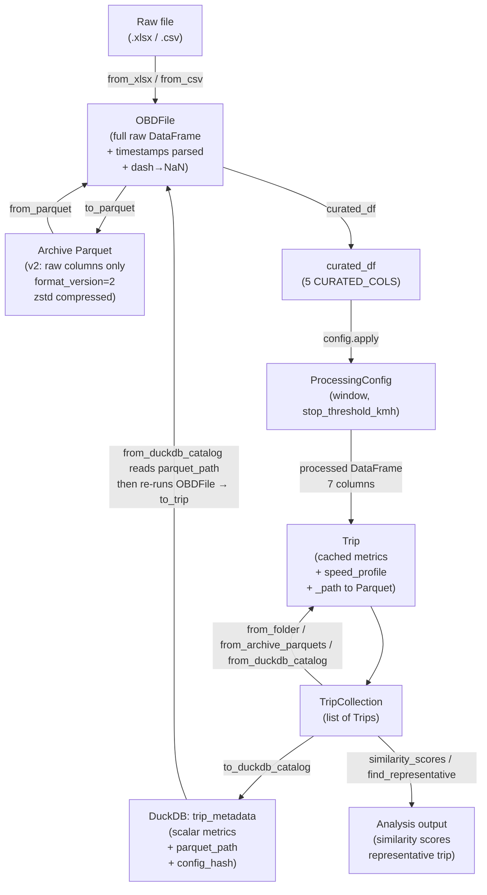

# Codebase Clarification Report

Audit date: 2026-04-17  
Scope: `src/drive_cycle_calculator/` + `examples/` — read-only, no source files modified.

This is related to v0.3 refactor design. The purpose is to clarify the current architecture, data flow, and design decisions before implementing the refactor. This report identifies key components, their interactions, and any inconsistencies or areas for improvement.

---

## Prompts used for this report

```
Task: Audit the current codebase @src and @examples and produce a clarification report at brainstorming/clarifications.md.
Do not modify any source files. Read-only audit only.
Address the following questions and structure the output as a markdown document with one section per question:
1. Architecture verification
Map out the actual data flow between these classes/objects: OBDFile, Trip, ProcessingConfig, and the DuckDB and Parquet storage layers. Specifically:

What does OBDFile receive as input and what does it produce?
What role does ProcessingConfig play — does it control OBDFile, Trip, or both?
What is written to Parquet — raw OBD data, processed Trip data, or both?
What is written to DuckDB — is it Trip metrics, parquet filenames/paths only, full trip data rows, or a combination?
Produce a corrected Mermaid flowchart reflecting the actual implementation.

2. DuckDB schema
Print the full DuckDB schema (all tables, columns, types). For each table, state whether it stores: file references only, scalar metrics, raw time-series data, or metadata.
3. Trip ID / filename scheme
How is the parquet filename currently generated? Is there any existing unique identifier for a trip, or is the filename the only key?
4. ProcessingConfig
What fields does ProcessingConfig contain? Is it currently serialized or stored anywhere (parquet metadata, DuckDB, config file), or does it only exist in memory at runtime?
5. Column inventory
What are the ~15 raw OBD columns in a typical input file, and which ~5-6 columns survive into a Trip object? Are these hardcoded or configurable via ProcessingConfig?
6. Ingest idempotency
If ingest is run twice on the same input file, what happens — does it skip, overwrite, error, or produce a duplicate?
7. Current CLI subcommands
List all currently implemented CLI subcommands, their arguments, and a one-line description of what each does based on the actual implementation (not the docstring alone — verify against the code).
```

---

## 1. Architecture Verification

### What OBDFile receives and produces

**Input:** One of three sources, all returning the same object type:
- `OBDFile.from_xlsx(path)` — reads Excel via `pd.read_excel`
- `OBDFile.from_csv(path, sep, decimal)` — reads CSV with auto-sniffed separator/decimal
- `OBDFile.from_parquet(path)` — reads a **v2 archive** Parquet (raises `ValueError` if it is the old v1 processed format)
- `OBDFile.from_file(path)` — dispatch by extension, delegates to the above

**Transformation on construction:**
1. Strip whitespace from column names
2. `_coerce_numeric_columns()` — Torque dash-placeholders (`"-"`) → NaN; skips timestamp columns
3. `_parse_timestamps()` — converts `GPS Time` and `Device Time` string columns → `datetime64[ns, UTC]`
4. Column validation against `CURATED_COLS` (raises `ValueError` if strict mode, warns otherwise)
5. Fuel unit fallbacks: if `Fuel flow rate/hour(l/hr)` is absent, tries to derive it from `Fuel Rate (direct from ECU)(L/m)` or `Fuel flow rate/hour(gal/hr)`

**Output (key members):**
| Member | Type | Content |
|--------|------|---------|
| `._df` | `pd.DataFrame` | Full raw DataFrame, all original columns, dash→NaN coerced, timestamps parsed |
| `.curated_df` | `pd.DataFrame` | `CURATED_COLS` subset of `_df` (5 columns) |
| `.full_df` | `pd.DataFrame` | Full `_df` copy |
| `.parquet_name` | `str` | Canonical stem `t<YYYYMMDD-hhmmss>-<duration_s>`, or filename stem as fallback |
| `.quality_report()` | `dict` | Row count, missing %, dash counts, GPS gaps, speed outliers, missing curated cols |
| `.to_trip(config)` | `Trip` | Calls `ProcessingConfig.apply()` and constructs a Trip |

---

### What role ProcessingConfig plays

`ProcessingConfig` is a pure **transformation controller**. It does not own any data; it is passed *into* `OBDFile.to_trip(config)`:

```
OBDFile.curated_df  →  config.apply(curated_df)  →  processed_df  →  Trip(processed_df)
```

It operates exclusively **between** `OBDFile` and `Trip`. It does not touch Parquet files and does not modify `OBDFile._df`.

**Fields:**
- `window: int = 4` — rolling window for speed smoothing
- `stop_threshold_kmh: float = 2.0` — speed threshold for stop classification

**What `apply()` does:**
1. Computes `elapsed_s` from GPS timestamps (seconds since first valid GPS row)
2. Applies rolling mean to speed → `smooth_speed_kmh`
3. Derives `acc_ms2` (signed m/s²) accounting for actual inter-sample interval
4. Renames curated columns via `OBD_COLUMN_MAP` → `speed_kmh`, `co2_g_per_km`, `engine_load_pct`, `fuel_flow_lph`
5. Returns a 7-column processed DataFrame

---

### What is written to Parquet

**Raw OBD data — the v2 archive format stores the complete pre-processing DataFrame.**

`OBDFile.to_parquet(path)` writes `self._df` — the full raw DataFrame with all original Torque columns (not just curated ones, not processed). Processed columns such as `smooth_speed_kmh` and `acc_ms2` are **not** in the Parquet. The file includes a `format_version = "2"` key in the PyArrow schema metadata.

When `from_archive_parquets` loads these files, each Parquet goes through `OBDFile.from_parquet()` → `to_trip(config)` every time, so processing is re-applied on load. There is no "processed Parquet."

> **Inconsistency found:** The legacy `examples/cli/ingest.py` names Parquets using `obd.name` (the raw filename stem). The current CLI `src/drive_cycle_calculator/cli/ingest.py` uses `obd.parquet_name` (the GPS-derived `t<timestamp>-<duration>` name). The GUI `src/drive_cycle_calculator/cli/gui.py` uses `obd.name` (legacy behavior).

---

### What is written to DuckDB

**Scalar metrics + parquet file path. No raw time-series data is stored in DuckDB.**

`TripCollection.to_duckdb_catalog()` upserts one row per trip into `trip_metadata`. The row contains:
- The path to the archive Parquet (so trips can be lazy-loaded later)
- 7 computed scalar metrics from `Trip.metrics` + `Trip.max_speed`
- `config_hash` (8-char md5 of `ProcessingConfig` fields)
- Several placeholder columns (`start_time`, `end_time`, `estimated_fuel_liters`, `wavelet_anomaly_count`, `markov_matrix_uri`, `pla_trajectory_uri`) that are **always NULL** in the current implementation

> **Bug found in `to_duckdb_catalog`:** The SQL INSERT has 16 positional `?` slots. The values list passes `parquet_path` twice — once for `parquet_path` (position 2) and again for `estimated_fuel_liters` (position 12, which is `NULL` in the schema). This is a latent bug: if `estimated_fuel_liters` was ever not-NULL, it would receive a file path string.

---

### Corrected Mermaid flowchart



---

## 2. DuckDB Schema

Table: **`trip_metadata`** (single table, no foreign keys)

| Column | Type | Currently populated? | Content |
|--------|------|---------------------|---------|
| `trip_id` | `VARCHAR` PRIMARY KEY | Yes | Sanitized `trip.name` (filesystem-safe; see §3) |
| `parquet_path` | `VARCHAR NOT NULL` | Yes | Absolute path to v2 archive Parquet |
| `start_time` | `TIMESTAMP` | **Always NULL** | Intended: GPS start timestamp |
| `end_time` | `TIMESTAMP` | **Always NULL** | Intended: GPS end timestamp |
| `duration_s` | `DOUBLE` | Yes | `Trip.metrics["duration"]` |
| `avg_velocity_kmh` | `DOUBLE` | Yes | `Trip.metrics["mean_speed"]` |
| `max_velocity_kmh` | `DOUBLE` | Yes | `Trip.max_speed` |
| `avg_acceleration_ms2` | `DOUBLE` | Yes | `Trip.metrics["mean_acc"]` |
| `avg_deceleration_ms2` | `DOUBLE` | Yes | `Trip.metrics["mean_dec"]` |
| `idle_time_pct` | `DOUBLE` | Yes | `Trip.metrics["stop_pct"]` |
| `stop_count` | `INTEGER` | Yes | `Trip.metrics["stops"]` |
| `estimated_fuel_liters` | `DOUBLE` | **Bug: receives parquet_path string** | Should be NULL; receives `parquet_path` value due to mis-ordered INSERT params |
| `wavelet_anomaly_count` | `INTEGER` | **Always NULL** | Placeholder |
| `markov_matrix_uri` | `VARCHAR` | **Always NULL** | Placeholder |
| `pla_trajectory_uri` | `VARCHAR` | **Always NULL** | Placeholder |
| `config_hash` | `VARCHAR` | Yes | First 8 chars of md5(`ProcessingConfig` JSON) |

**Classification:** `trip_metadata` is a **scalar metrics + file reference table**. It stores derived aggregates (7 scalars) and a pointer back to the raw time-series Parquet. No raw time-series rows are stored in DuckDB.

The `config_hash` column is added via `ALTER TABLE ... ADD COLUMN IF NOT EXISTS` for backward-compatibility when older catalogs lack it.

---

## 3. Trip ID / Filename Scheme

### Parquet filename generation

There are **two different schemes** in use, depending on which code path is used:

**1. Current CLI (`src/drive_cycle_calculator/cli/ingest.py`):**
Uses `obd.parquet_name` property.  
Format: `t<YYYYMMDD-hhmmss>-<duration_s>.parquet`  
Example: `t20190922-071345-3240.parquet`

The `parquet_name` property (in `obd_file.py:308`) takes the UTC timestamp of the first valid GPS row (`YYYYMMDD-hhmmss`) and appends the integer total elapsed seconds. Falls back to `self.name` (raw filename stem) if GPS Time is absent or unparseable.

**2. Legacy examples ingest (`examples/cli/ingest.py`) and GUI (`src/drive_cycle_calculator/cli/gui.py`):** (OBSOLETE DO NOT USE/UPDATE TO MATCH CLI)
Uses `obd.name` (the raw source filename stem).  
Example: `2019-09-22_Morning.parquet` 

### DuckDB trip_id

The `trip_id` in DuckDB is `TripCollection._sanitise_name(trip.name)` where `trip.name` is set from `obd.name` at `to_trip()` call time (not from `parquet_name`).

`_sanitise_name` replaces any character that is not `[a-zA-Z0-9_\-.]` with `_`.

**There is no globally unique trip identifier** beyond the filename stem. The filename is the only key. The `trip_id` and the Parquet filename stem are derived independently from the same source (`trip.name` / `obd.name`), so they should match — but only if the same code path generates both. Ultimately, there should be a single consistent scheme naming/identifying raw data, and a single separate for the trip (rawdata+ProcessingConfig) that is stored in DuckDB.

---

## 4. ProcessingConfig

### Fields

```python
@dataclasses.dataclass
class ProcessingConfig:
    window: int = 4                 # rolling mean window size (samples)
    stop_threshold_kmh: float = 2.0 # speed below which sample = stopped
    # More fields might be included. 
```

Plus one computed property:
- `config_hash: str` — `@cached_property`, first 8 chars of md5(sorted JSON of `dataclasses.asdict(self)`)

### Serialization / persistence

`ProcessingConfig` is **only partially persisted**:

| Location | What is stored | When |
|----------|---------------|------|
| DuckDB `config_hash` column | 8-char hash (not the full config) | Every `to_duckdb_catalog()` call |
| Parquet metadata | **Nothing** | Not stored at all |
| Config file | **Nothing** | Not stored |

The config itself (field values) is **never persisted** — only its hash is written to DuckDB. This means the hash can be audited for consistency, but the original parameter values cannot be recovered from storage alone.

The `smooth_and_derive()` function in `processing_config.py:114` is marked `# TODO: Remove from codebase` and is not called anywhere in the active pipeline.

---

## 5. Column Inventory

### Raw OBD columns (typical Torque export)

The full Torque export typically contains 20–30+ columns. The ones the package is aware of or uses:

| Column name (raw) | Role |
|---|---|
| `GPS Time` | Primary timestamp; used for `elapsed_s` computation |
| `Device Time` | Secondary timestamp; stored but not used in processing |
| `Speed (OBD)(km/h)` | Input to smoothing → `smooth_speed_kmh`, `acc_ms2` |
| `CO₂ in g/km (Average)(g/km)` | Passed through → `co2_g_per_km` |
| `Engine Load(%)` | Passed through → `engine_load_pct` |
| `Fuel flow rate/hour(l/hr)` | Passed through → `fuel_flow_lph` |
| `Fuel Rate (direct from ECU)(L/m)` | Fallback source for fuel flow (×60 → l/hr) |
| `Fuel flow rate/hour(gal/hr)` | Fallback source for fuel flow (×3.78541 → l/hr) |
| `Latitude` | Used by `_trip_spatial_metadata()` (currently disabled in `__init__`) |
| `Longitude` | Used by `_trip_spatial_metadata()` |
| `Altitude` | Used by `_trip_spatial_metadata()` |

All other columns (e.g. RPM, coolant temp, manifold pressure, etc.) are **preserved in the archive Parquet** but ignored by the analysis pipeline.

### Surviving into a Trip object

Only the 5 `CURATED_COLS` survive through `curated_df`, and after `ProcessingConfig.apply()` they become 7 processed columns:

| Processed column | Source | How derived |
|---|---|---|
| `elapsed_s` | `GPS Time` | Seconds since first valid GPS timestamp |
| `smooth_speed_kmh` | `Speed (OBD)(km/h)` | Rolling mean, `window` samples |
| `acc_ms2` | `Speed (OBD)(km/h)` | `diff(smooth_speed / 3.6) / dt_s` |
| `speed_kmh` | `Speed (OBD)(km/h)` | Rename only (raw, unsmoothed) |
| `co2_g_per_km` | `CO₂ in g/km (Average)(g/km)` | Rename + `pd.to_numeric` |
| `engine_load_pct` | `Engine Load(%)` | Rename + `pd.to_numeric` |
| `fuel_flow_lph` | `Fuel flow rate/hour(l/hr)` | Rename + `pd.to_numeric` |

### Hardcoded vs. configurable

**Hardcoded:** All column names are hardcoded in `_schema.py` (`CURATED_COLS`, `OBD_COLUMN_MAP`). There is no runtime configuration mechanism to change which columns are selected or what they map to.

**Configurable via ProcessingConfig:** Only the smoothing `window` and `stop_threshold_kmh`.

---

## 6. Ingest Idempotency

### Parquet layer

The ingest CLI writes: `archive_dir / f"{obd.parquet_name}.parquet"`

If the same input file is ingested again:
- `obd.parquet_name` produces the same filename (it is deterministic: based on GPS timestamp + duration)
- `obd.to_parquet(dest)` calls `pq.write_table(...)` with no guard — it **silently overwrites** the existing file

**Result: idempotent overwrite. No error, no duplicate, no skip.**

### DuckDB layer

`to_duckdb_catalog` uses `INSERT OR REPLACE INTO trip_metadata VALUES (...)` keyed on `trip_id`.

If the same trip is cataloged again, DuckDB replaces the existing row.

**Result: idempotent overwrite. No error, no duplicate.**

### Caveat

If the same raw file is ingested via **both the CLI** (which uses `parquet_name`) and the **GUI or legacy script** (which uses `obd.name`), two different Parquet files are written and two different `trip_id` rows are inserted — creating duplicates that are only distinguishable by filename convention. There is no content-hash deduplication.

---

## 7. Current CLI Subcommands

The CLI entry point is `dcc` (registered via `src/drive_cycle_calculator/cli/main.py` using Typer). There are three subcommands:

### `dcc ingest <raw_dir> <out_dir> [options]`

**Source:** `src/drive_cycle_calculator/cli/ingest.py`

Ingests raw OBD files from `<raw_dir>` into v2 archive Parquets (written to `<out_dir>/trips/`) and upserts trip metadata into DuckDB at `<out_dir>/metadata.duckdb`.

**Arguments:**
| Name | Type | Required | Description |
|------|------|----------|-------------|
| `raw_dir` | `Path` | Yes | Directory containing raw OBD exports (`.xlsx`, `.xls`, `.csv`) |
| `out_dir` | `Path` | Yes | Output directory; `trips/` subdir and `metadata.duckdb` are created here |

**Options:**
| Flag | Default | Description |
|------|---------|-------------|
| `--format / -f` | `"auto"` | Filter by file type: `"auto"` (extension), `"xlsx"`, `"xls"`, `"csv"` |
| `--sep` | `None` | CSV field delimiter override; auto-sniffed if omitted |
| `--decimal` | `None` | CSV decimal separator override; auto-inferred if omitted |

**What it actually does:**
1. Globs all matching files in `raw_dir`
2. For each file: loads via `OBDFile.from_file()`, checks `quality_report()` for missing CURATED_COLS, skips bad files
3. Writes valid files to `archive_dir/{parquet_name}.parquet` (overwrites if exists)
4. Calls `TripCollection.from_archive_parquets(archive_dir)` to re-process all archived Parquets (not just the new ones)
5. Upserts all trips into DuckDB catalog

---

### `dcc analyze <data_dir>`

**Source:** `src/drive_cycle_calculator/cli/analyze.py`

Loads trips from the DuckDB catalog in `<data_dir>/metadata.duckdb`, computes 7-metric similarity scores, prints a ranked table, and prints the key metrics of the most representative trip.

**Arguments:**
| Name | Type | Required | Description |
|------|------|----------|-------------|
| `data_dir` | `Path` | Yes | Directory containing `metadata.duckdb` (produced by `dcc ingest`) |

**No options.** Fails with a red error if `metadata.duckdb` does not exist.

**What it actually does:**
1. Opens DuckDB catalog via `TripCollection.from_duckdb_catalog(db_path)`, which re-loads each Parquet from its stored path and re-runs `to_trip(DEFAULT_CONFIG)`
2. Calls `tc.similarity_scores()` — 7-metric Euclidean-style scoring against collection mean
3. Prints scores sorted descending
4. Calls `tc.find_representative()` — returns the trip with highest score
5. Prints `mean_speed`, `max_speed`, `stop_pct`, `duration` for the representative trip

---

### `dcc gui [--data-dir <path>]`

**Source:** `src/drive_cycle_calculator/cli/gui.py`

Launches a Tkinter + Matplotlib GUI window with a scrollable log pane.

**Options:**
| Flag | Default | Description |
|------|---------|-------------|
| `--data-dir` | `"./data"` | Default data directory; determines archive dir (`data/trips/`) and catalog path (`data/metadata.duckdb`) |

**Three interactive modes (buttons):**
1. **"Import raw files → write archive"** — opens folder picker, loads all `.xlsx/.xls/.csv` files via `OBDFile.from_file()`, writes Parquets using `obd.name` (not `parquet_name`), then calls `_register_and_display()` which catalogs and plots
2. **"Load existing archive parquets"** — opens folder picker pointing to an existing archive dir, calls `TripCollection.from_archive_parquets()` + `to_duckdb_catalog()` + plots
3. **"Reload from catalog"** — reads existing DuckDB catalog, finds representative trip, plots its speed profile

> **Note:** The GUI uses `obd.name` for the Parquet filename (not `obd.parquet_name`), unlike the `dcc ingest` CLI. This creates different filenames for the same raw data depending on which entry point is used.

---

### Example scripts (not registered as CLI subcommands)

Usually the example folder serves as a scratchpad for testing ideas and code snippets, so these scripts are not necessarily up-to-date or consistent with the current CLI behavior. Some might be ahead some might be proof of concepts of future directions. However, here is an inventory of recently edited files:

| Script | Status | Description |
|--------|--------|-------------|
| `examples/cli/ingest.py` | **OBSOLETE** (self-declared) | Original two-stage ingest; uses `obd.name` for Parquet filenames |
| `examples/cli/analyze.py` | **OBSOLETE** (self-declared) | Original analyze script |
| `examples/cli-single/*.py` | Reference | Single-file inspection/analysis scripts |
| `examples/storage/parse_trips.py` | Active notebook | Iterates archive Parquets, calls `obd.get_metrics()`, exports CSV, plots spatial ellipses |
