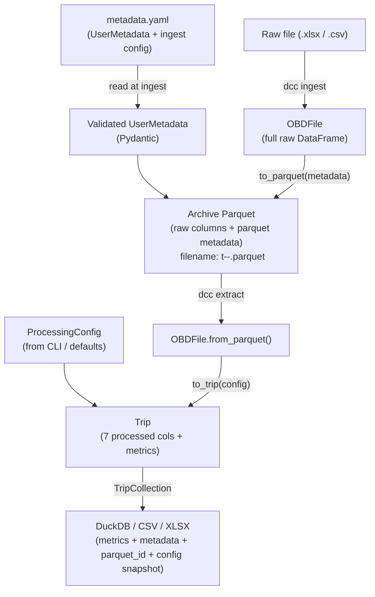

# Drive Cycle Calculator — Refactor Design Document

**Version:** 0.3
**Date:** 2026-04-18  
**Status:** Pre-implementation — for validation by Claude Code before execution

---

## 1. Context and Goals

This document describes a planned refactor of `drive_cycle_calculator` (`dcc`). The primary triggers are:

1. No user/vehicle/fuel metadata exists anywhere in the current pipeline.
2. Ingest is coupled to DuckDB generation, making it expensive and inflexible.
3. No canonical trip identity scheme exists; two naming conventions coexist.
4. `ProcessingConfig` field values are never persisted — only an 8-char hash survives.
5. Several DuckDB columns are always NULL or contain bugs (`estimated_fuel_liters`).

The refactor prioritises **correctness and flexibility over performance**. Caching and
optimisation are explicitly deferred.

---

## 2. Target Architecture



**Key invariant:** The archive Parquet is the single source of truth. Everything downstream
(Trip, metrics, DuckDB) is a derived, reproducible artifact.

---

## 3. Canonical Trip Identity

### 3.1 Parquet filename

**Format:** `t<YYYYMMDD-hhmmss>-<duration_s>-<hash6>.parquet`

**Example:** `t20190922-071345-3240-a3f9bc.parquet`

- `<YYYYMMDD-hhmmss>`: UTC timestamp of first valid GPS row (existing `parquet_name` logic).
- `<duration_s>`: integer total elapsed seconds (existing logic).
- `<hash6>`: first 6 hex characters of `sha256(lat_bytes + lon_bytes)` where `lat_bytes`
  and `lon_bytes` are the raw bytes of the `Latitude` and `Longitude` Series values. 
  If GPS columns are absent, raise an error (strict mode) or fallback to `sha256(obd.name.encode())` (permissive mode).

This hash provides deduplication without being the primary key — the timestamp+duration
remains human-readable.

> **Backward compatibility:** Existing archive Parquets in `data/trips/` use the old
> `t<ts>-<dur>` format without the hash suffix. This break is accepted for v0.3 — old
> files are not renamed. Re-ingesting an old file will produce a new `t<ts>-<dur>-<hash6>`
> filename alongside the old one; users should delete old archives after re-ingest.

### 3.2 DuckDB `trip_id`

`trip_id` is set to the **parquet filename stem** (without `.parquet`), derived from
`obd.parquet_name` only. The legacy `obd.name`-based scheme is removed from all active
code paths. The GUI is updated to match.

### 3.3 ProcessingConfig fingerprint

A separate `config_hash` column stores the full md5 of the serialised `ProcessingConfig`
(existing behaviour). Additionally, a `config_snapshot` column (JSON string) stores the
full field values — not just the hash — so past configs are recoverable without the
source code.

---

## 4. Metadata Schema (Pydantic)

### 4.1 Pydantic models

All models live in `src/drive_cycle_calculator/schema.py`.

Grouping principle: **provenance** — each sub-model reflects *who or what is responsible
for its fields*, not what type the fields are. This makes debugging straightforward:
wrong value → check the responsible party.

```python
from datetime import datetime
from enum import Enum
from typing import Optional
from pydantic import BaseModel, Field

# --- Enums ---

class FuelType(str, Enum):
    PETROL   = "petrol"
    DIESEL   = "diesel"
    E10      = "e10"
    E85      = "e85"
    HYBRID   = "hybrid"
    ELECTRIC = "electric"
    LPG      = "lpg"
    OTHER    = "other"

class VehicleCategory(str, Enum):
    SEDAN      = "sedan"
    SUV        = "suv"
    HATCHBACK  = "hatchback"
    VAN        = "van"
    TRUCK      = "truck"
    MOTORCYCLE = "motorcycle"
    OTHER      = "other"

# --- Sub-models (provenance-grouped) ---

class UserMetadata(BaseModel):
    """Declared by the user via metadata.yaml. All fields optional."""
    fuel_type:        Optional[FuelType]        = Field(None, description="Fuel type used")
    vehicle_category: Optional[VehicleCategory] = Field(None, description="Body style")
    user:             Optional[str]             = Field(None, description="Identifier for the driver/user")
    vehicle_make:     Optional[str]             = Field(None, description="Manufacturer, e.g. Toyota")
    vehicle_model:    Optional[str]             = Field(None, description="Model name, e.g. Yaris")
    engine_size_cc:   Optional[int]             = Field(None, description="Engine displacement in cc")
    year:             Optional[int]             = Field(None, description="Vehicle model year")
    misc:             Optional[dict]            = Field(None, description="Any additional key-value metadata")

    model_config = {"use_enum_values": True}  # serialises enums as plain strings

class IngestProvenance(BaseModel):
    """Recorded by the ingest process. Describes the software action."""
    ingest_timestamp: datetime = Field(description="UTC timestamp when ingest was run")
    source_filename:  str      = Field(description="Original filename of the raw OBD export")

class ComputedTripStats(BaseModel):
    """Derived from the raw signal during ingest. Never user-supplied."""
    start_time:   datetime = Field(description="UTC timestamp of first valid GPS row")
    end_time:     datetime = Field(description="UTC timestamp of last valid GPS row")
    gps_lat_mean: float    = Field(description="Mean latitude over the trip")
    gps_lat_std:  float    = Field(description="Std deviation of latitude")
    gps_lon_mean: float    = Field(description="Mean longitude over the trip")
    gps_lon_std:  float    = Field(description="Std deviation of longitude")

# --- Top-level container ---

class ParquetMetadata(BaseModel):
    """Root metadata object embedded in every archive Parquet."""
    schema_version:   str    = Field(description="dcc_metadata schema version")
    software_version: str    = Field(description="drive_cycle_calculator package version")
    parquet_id:       str    = Field(description="6-char sha256 hash of raw GPS lat+lon data")

    ingest_provenance:  IngestProvenance
    computed_trip_stats: ComputedTripStats
    user_metadata:      UserMetadata
```

**Validation behaviour:** Pydantic fires on enum fields if a non-null value is supplied.
A typo like `"gazoline"` raises a `ValidationError` naming the field and listing valid
options. Free-form string fields accept anything. All `UserMetadata` fields are `Optional`
— a completely empty `UserMetadata` is valid.

**Schema evolution:** adding new optional fields and new enum variants are non-breaking.
Removing or renaming fields requires a migration note in the changelog.

### 4.2 Parquet metadata structure

Stored in the PyArrow schema metadata as a single JSON-encoded blob under the key
`"dcc_metadata"`, produced via `ParquetMetadata.model_dump_json()` and recovered via
`ParquetMetadata.model_validate_json(...)`.

```json
{
  "schema_version": "1.0",
  "software_version": "0.3.0",
  "parquet_id": "a3f9bc",
  "ingest_provenance": {
    "ingest_timestamp": "2026-04-17T09:00:00Z",
    "source_filename": "morning_commute.xlsx"
  },
  "computed_trip_stats": {
    "start_time": "2026-04-17T07:30:00Z",
    "end_time":   "2026-04-17T08:05:00Z",
    "gps_lat_mean": 37.9755,
    "gps_lat_std":  0.0021,
    "gps_lon_mean": 23.7348,
    "gps_lon_std":  0.0018
  },
  "user_metadata": {
    "user": "nikos",
    "fuel_type": "diesel",
    "vehicle_category": "sedan",
    "vehicle_make": "Toyota",
    "vehicle_model": "Yaris",
    "engine_size_cc": 1400,
    "year": 2019,
    "misc": {"tyre_pressure_bar": 2.2}
  }
}
```

`computed_trip_stats.gps_lat/lon_mean` support cheap centroid-based bounding-box
filtering at extract time without scanning array data.

---

## 5. Ingest Config (metadata.yaml)

### 5.1 config-init subcommand

```
dcc config-init <folder>
```

Writes a `metadata-<folder>.yaml` template into `<folder>` (where `<folder>` is the
directory basename, e.g. `metadata-morning_commute.yaml`). The template is generated
from the `UserMetadata` Pydantic model using field descriptions as inline YAML comments.
Fields with enum constraints list valid options in the comment. All values default to `null`.

Example output:

```yaml
# Drive Cycle Calculator — folder metadata
# Fill in the fields below. Leave as null if unknown.
# This file applies to ALL raw OBD files in this folder.

# Identifier for the driver/user
user: null

# Fuel type used. Valid values: petrol, diesel, e10, e85, hybrid, electric, lpg, other
fuel_type: null

# Body style. Valid values: sedan, suv, hatchback, van, truck, motorcycle, other
vehicle_category: null

# Manufacturer, e.g. Toyota
vehicle_make: null

# Model name, e.g. Yaris
vehicle_model: null

# Engine displacement in cc (integer)
engine_size_cc: null

# Vehicle model year (integer)
year: null

# Any additional key-value pairs not covered above
misc: {}

# --- Ingest settings ---
# CSV field delimiter. Leave null for auto-detection.
sep: null

# CSV decimal separator. Leave null for auto-detection.
decimal: null
```

### 5.2 Ingest behaviour with metadata-<folder>.yaml

`dcc ingest <raw_dir> <out_dir>`:

1. Looks for `<raw_dir>/metadata-<basename>.yaml` where `<basename>` is `raw_dir.name`.
   If present, loads and validates via `UserMetadata`. If absent, proceeds with all
   `UserMetadata` fields as `None` (no error — permissive default for backwards compatibility).
2. `sep` and `decimal` in the YAML override CLI flags if present; CLI flags take precedence
   if both are supplied (flag > yaml > auto-detect).
3. Validated `UserMetadata` is embedded in every Parquet written from that folder.

**No `--override` flag needed:** the absence of `metadata.yaml` is itself the "use
defaults" case.

---

## 6. Decoupled Pipeline: Ingest vs Extract

### 6.1 Ingest (revised)

**Responsibility:** Raw file → self-contained archive Parquet. Nothing else.

Steps:
1. Load raw file via `OBDFile.from_file()`.
2. Validate curated columns (strict mode by default).
3. Compute `parquet_id` (6-char GPS hash).
4. Compute `start_time`, `end_time` from GPS timestamps.
5. Compute `gps_lat/lon_mean/std`.
6. Assemble `ParquetMetadata` (schema_version, software_version, parquet_id,
   `IngestProvenance`, `ComputedTripStats`, `UserMetadata`) and serialise to JSON.
7. Write `<out_dir>/trips/<parquet_name>.parquet` with embedded metadata.

**Does NOT:** create or update DuckDB. Does NOT call `TripCollection`. Does NOT
re-process previously ingested files.

### 6.2 Extract (new subcommand)

```
dcc extract <data_dir> [options]
```

**Responsibility:** Read archive Parquets → apply ProcessingConfig → output metrics.

Options:

| Flag | Default | Description |
|------|---------|-------------|
| `--output` | `duckdb` | Output format: `duckdb`, `csv`, `xlsx` |
| `--out-file` | `<data_dir>/metrics.duckdb` | Output path |
| `--window` | `4` | ProcessingConfig rolling window |
| `--stop-threshold` | `2.0` | ProcessingConfig stop threshold (km/h) |
| `--from` | None | Filter: start date (ISO 8601) |
| `--to` | None | Filter: end date (ISO 8601) |
| `--lat-min/max` | None | Filter: GPS latitude bounding box (centroid-based) |
| `--lon-min/max` | None | Filter: GPS longitude bounding box (centroid-based) |

Filtering is performed on parquet metadata only (no array scanning) using
`gps_lat_mean`, `gps_lon_mean`, `start_time` stored at ingest. This keeps extract fast
regardless of data volume.

Output schema (one row per trip):

| Column | Source |
|--------|--------|
| `trip_id` | parquet filename stem |
| `parquet_path` | absolute path |
| `parquet_id` | 6-char GPS hash |
| `start_time` | from parquet metadata |
| `end_time` | from parquet metadata |
| `user` | UserMetadata.user |
| `fuel_type` | UserMetadata.fuel_type |
| `vehicle_category` | UserMetadata.vehicle_category |
| `vehicle_make` | UserMetadata.vehicle_make |
| `vehicle_model` | UserMetadata.vehicle_model |
| `engine_size_cc` | UserMetadata.engine_size_cc |
| `year` | UserMetadata.year |
| `gps_lat_mean` | ComputedTripStats.gps_lat_mean |
| `gps_lon_mean` | ComputedTripStats.gps_lon_mean |
| `duration_s` | Trip.metrics |
| `avg_velocity_kmh` | Trip.metrics |
| `max_velocity_kmh` | Trip.max_speed |
| `avg_acceleration_ms2` | Trip.metrics |
| `avg_deceleration_ms2` | Trip.metrics |
| `idle_time_pct` | Trip.metrics |
| `stop_count` | Trip.metrics |
| `config_hash` | ProcessingConfig.config_hash |
| `config_snapshot` | JSON string of ProcessingConfig fields |

---

## 7. OBDFile Strictness

`OBDFile` gains a `strict: bool = True` constructor parameter propagated through all
classmethods (`from_xlsx`, `from_csv`, `from_parquet`, `from_file`).

**Strict mode (default, used by CLI):**
- Missing curated columns → `ValueError` with a message naming the missing columns.
- Used by `dcc ingest` always; not user-configurable via CLI flags.

**Permissive mode (`strict=False`, library use only):**
- Missing curated columns → NaN columns injected so `curated_df` always has the
  expected shape.
- Intended for debugging and exploratory analysis in notebooks/scripts.
- Not exposed as a CLI flag.

---

## 8. ProcessingConfig

No functional changes to `ProcessingConfig` fields at this stage. Changes:

1. `ProcessingConfig` becomes a Pydantic `BaseModel` (replacing the `dataclass`) to
   enable schema validation, JSON serialisation, and future extension.
2. `config_hash` remains (md5 of sorted JSON).
3. `config_snapshot` property added: returns `model_dump_json()` — the full field values
   as a JSON string, suitable for storing in DuckDB and parquet metadata.

The `smooth_and_derive()` dead code is removed.

---

## 9. Bug Fixes (in scope)

| Bug | Fix |
|-----|-----|
| `estimated_fuel_liters` receives `parquet_path` string | Remove the column; add it back only when actually implemented |
| `start_time` / `end_time` always NULL | Populated at ingest from GPS timestamps |
| GUI uses `obd.name` not `parquet_name` | Update GUI to use `parquet_name` |
| Ingest re-processes all archive parquets on every run | Ingest no longer calls `TripCollection`; DuckDB creation moved to `extract` |

---

## 10. CLI Subcommand Summary (target state)

| Subcommand | Status | Description |
|------------|--------|-------------|
| `dcc config-init <folder>` | **New** | Write `metadata.yaml` template into folder |
| `dcc ingest <raw_dir> <out_dir>` | **Revised** | Raw → archive Parquet with embedded metadata. No DuckDB. |
| `dcc extract <data_dir>` | **New** | Archive Parquets → DuckDB / CSV / XLSX with metrics |
| `dcc analyze <data_dir>` | **Revised** | Similarity analysis — reads `metrics.duckdb`/`trip_metrics` (produced by extract). DB path and table name updated from v0.2. |
| `dcc gui` | **Bug-fix only** | Update to use `parquet_name` scheme |

---

## 11. Deferred / Out of Scope

- CSV → Parquet direct ingest (bypassing XLSX intermediate)
- Processed/cached Parquet (Trip-level parquet for performance)
- TripMetrics Pydantic schema (hardcoded column names remain for now)
- Multi-table DuckDB schema (single `trip_metadata` table sufficient for now)
- GPS bounding box filtering on full trajectory (centroid only for now)
- Fuel consumption metrics (`estimated_fuel_liters`)

---

## 12. Open Questions for Claude Code Validation

Before implementation, Claude Code should verify:

1. Does `OBDFile.parquet_name` reliably produce a valid filename stem for all known
   input files, including the GPS-absent fallback path?
2. Are `Latitude` and `Longitude` column names stable across all known Torque export
   variants, or do they appear under alternate names in some files?
3. ✅ `TripCollection.from_archive_parquets` is the ingest-side bulk reprocessing site
   (called in `cli/ingest.py:94`). `from_duckdb_catalog` is a separate path used by
   `analyze` and `gui`. Both are removed/revised in v0.3.
4. Confirm the full list of call sites for `obd.name` that need updating to
   `obd.parquet_name`.
5. Does the current `analyze` subcommand depend on any DuckDB columns that will be
   removed or renamed by this refactor (specifically `estimated_fuel_liters`)?