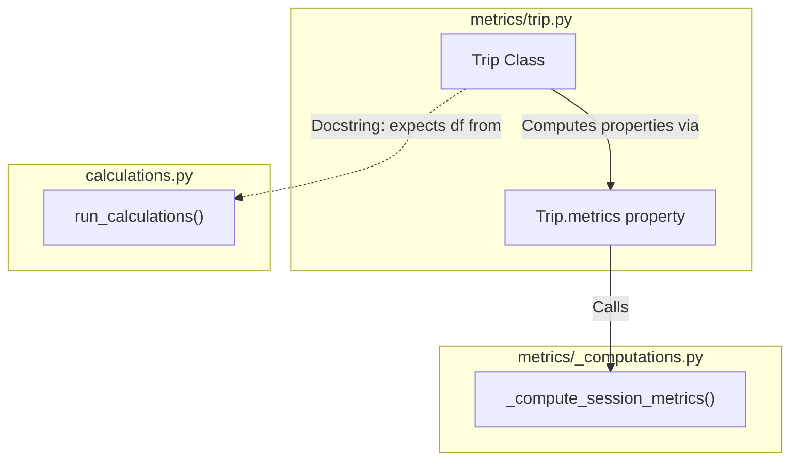
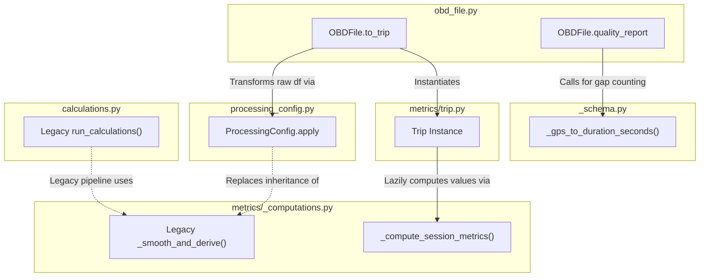

# Analysis of Method Dependencies

This document analyzes the dependencies of `obd_file.py` and `metrics/trip.py` on the core computation modules `metrics/_computations.py` and `calculations.py`.

## 1. `metrics/trip.py`

The `Trip` class (in `metrics/trip.py`) is the core domain class representing a recorded driving session and presenting its metrics.

- **Direct dependencies**: It directly imports and invokes `_compute_session_metrics` from `metrics/_computations.py`. This method calculates all 7 core session metrics (duration, mean speed, mean acceleration, mean deceleration, etc.) simultaneously on first access.
- **Documentation dependencies**: It references `calculations.run_calculations()` and `_computations._process_raw_df()` in its docstrings as the expected provenance for the dataframe it encapsulates.

## 2. `obd_file.py`

The `OBDFile` class (in `obd_file.py`) wraps a raw OBD file for data ingestion, quality reporting, and trip initialization.

- **Dependencies**: `obd_file.py` **does not** actually call `calculations.py` or `metrics/_computations.py` directly. 
- **Decoupled Architecture**: 
  - For time gap computations in its quality reports, it uses `_gps_to_duration_seconds()` from `_schema.py`.
  - To process the trips (`to_trip()`), it utilizes `processing_config.py` which reimplements the mathematical derivation logic into a new vectorised flow.
  - Once processed, it simply instantiates a `Trip` from `trip.py`, handing off the computational responsibility.

## Summary
- **`trip.py`** is directly coupled to `metrics/_computations.py` (specifically `_compute_session_metrics()`) to evaluate final statistical markers of the dataset.
- **`obd_file.py`** is an orchestrator that avoids direct ties to `_computations.py` or `calculations.py`. It uses a decoupled `ProcessingConfig` to format data and passes it to `Trip`, acting as the bridge from raw IO to analytical `Trip` objects without using legacy computation scripts directly.
