```mermaid
flowchart TD
    A([Raw speed-time trace\nv&#40;t&#41; sampled at 1 Hz])

    A --> B[Step 1 — Segment into microtrips\nStop-to-stop · v≤2 km/h ≥ 1 s · discard T < 15 s or d < 50 m]

    B --> METRICS

    subgraph METRICS[Per-microtrip kinematic metrics]
        direction TB
        M1[Distance d\n∑ v·Δt]
        M2[Duration T\nTotal elapsed seconds]
        M3[Mean speed v̄\nd / time in motion]
        M4[Idle fraction f_idle\n∑ 1v=0·Δt / T]
        M5[Mean a⁺ / a⁻\navg over positive / negative samples]
        M6[Max speed v_max\nmax v&#40;tₖ&#41;]
        M7[RPA\n∑ v·a⁺ / d]
        M8[v₉₅\n95th percentile of v&#40;tₖ&#41;]
    end

    METRICS --> C[Step 2 — Phase assignment by v_max\nLow ≤56.5 · Med ≤76.6 · High ≤97.4 · xHigh >97.4 km/h\nClass 3b uses all 4 phases · lower classes may omit xHigh]

    C --> D[Step 3 — Build global Markov matrix T\nDiscretise v,a state space · count transitions C_ij\nT_ij = C_ij / ∑ C_ij · coarser bins for small datasets]

    D --> E[Step 4 — Define phase targets τ_p\nWeighted mean of v̄ · RPA · f_idle · v₉₅ per phase\nWeights = microtrip duration T_i &#40;distance for RPA&#41;]

    E --> LOOP

    subgraph LOOP[For each phase p — repeat independently]
        direction TB
        S1[Step 5a — Assemble candidate sequence\nDraw microtrips with weight ∝ exp−λ·D&#40;T_i · T&#41;\nuntil distance/duration target met · allow reuse if M_p small]
        S2[Step 5b — Evaluate fit F_p\nF_p = ∑ wm · &#40;τ̂m − τm&#41;² / τm²\nAccept if F_p < 0.01]
        S3[Step 5c — Repeat 1000 trials · keep best sequence\nBreak early if F_p < 0.01]
        S1 --> S2 --> S3
    end

    LOOP --> F[Step 6 — Concatenate · smooth · validate\nLow → Med → High → xHigh + 20 s inter-phase idle\nLinear bridge ≤ 3 s at junctions · check all tolerances]

    F --> G([Final cycle v&#40;t&#41;\nValidated speed-time trace])

    F -- validation fails --> LOOP
```

# WLTP Driving Cycle Construction: Algorithmic Specification
## Based on UNECE GTR No. 15, Annex 1

---

## Pipeline Overview

The synthesis runs as five numbered scripts (orchestrated by `100_microtrips_synthesis_wltp.py`).
Each script reads the outputs of the previous one; re-running any single step is safe.

| Script | Section | Inputs | Output(s) |
|---|---|---|---|
| `110_wltp_phase_assignment.py` | §2 | `data/microtrips/summary.csv` | `data/synthesis/microtrips_phased.csv` |
| `120_wltp_markov_chain.py` | §3 | `microtrips_phased.csv` + microtrip parquets | `markov/global_matrix.csv`, `markov/microtrip_distances.csv` |
| `130_wltp_phase_targets.py` | §4 | `microtrips_phased.csv` | `data/synthesis/phase_targets.csv` |
| `140_wltp_selection.py` | §5 | phased, distances, targets | `selected/phase_<p>_sequence.csv`, `selection_report.csv` |
| `150_wltp_assembly.py` | §6 | selected sequences + parquets | `final_cycle.csv`, `final_cycle.png`, `validation_report.md` |

**Prerequisites:** Run `01_ingest.py → 02_extract_analyze.py → 03_build_microtrips.py` first.
All algorithm parameters are in `examples/workflow/config_wltp.json`.

---

## 0. Notation and Conventions

| Symbol | Definition |
|---|---|
| $M$ | Full set of microtrips (stop-to-stop segments) |
| $M_p$ | Subset of microtrips assigned to phase $p$ |
| $v(t)$ | Instantaneous speed at time $t$ |
| $a(t)$ | Instantaneous acceleration at time $t$ |
| $d_i$ | Distance of microtrip $i$ (m) |
| $T_i$ | Total duration of microtrip $i$ (motion + trailing stop, s) |
| $v_{max,i}$ | Maximum speed within microtrip $i$ (km/h) |
| $\bar{v}_i$ | Mean speed (excluding idle) of microtrip $i$ (km/h) |
| $f_{idle,i}$ | Fraction of time with $v = 0$ in microtrip $i$ |
| $\text{RPA}_i$ | Relative positive acceleration of microtrip $i$ (m/s²) |
| $\mathbf{T}$ | Markov transition probability matrix |
| $s_k$ | Discrete state $k$ in the $(v, a)$ state space |

---

## 1. Pre-processing: Microtrip Extraction

This step is performed by `03_build_microtrips.py` (not part of the 110–150 scripts).
If `data/microtrips/summary.csv` already exists, proceed directly to §2.

### 1.1 Segmentation Rule

A **microtrip** is defined as a segment of a speed-time trace bounded by two consecutive stops,
where a stop is defined as $v \leq 2$ km/h for at least 1 second.

- Include the trailing stop (the idle period at the end) within the microtrip.
- The leading stop of the next microtrip begins at the first sample above the stop threshold.
- Minimum microtrip duration: **>= 15 s**; minimum distance: **>= 50 m** (shorter segments are discarded as noise).

### 1.2 Per-Microtrip Kinematic Metrics

Compute the following for each microtrip $i$:

**Distance:**
$$d_i = \int_0^{T_i} v(t)\, dt \approx \sum_k v(t_k) \cdot \Delta t$$

**Mean speed (motion only, i.e. excluding idle):**
$$\bar{v}_i = \frac{d_i}{\sum_k \mathbf{1}[v(t_k) > 0] \cdot \Delta t}$$

**Idle fraction:**
$$f_{idle,i} = \frac{\sum_k \mathbf{1}[v(t_k) = 0] \cdot \Delta t}{T_i}$$

**Mean positive acceleration:**
$$\bar{a}^+_i = \frac{\sum_k a(t_k) \cdot \mathbf{1}[a(t_k) > 0]}{\sum_k \mathbf{1}[a(t_k) > 0]}$$

**Mean deceleration (magnitude):**
$$\bar{a}^-_i = \frac{\sum_k |a(t_k)| \cdot \mathbf{1}[a(t_k) < 0]}{\sum_k \mathbf{1}[a(t_k) < 0]}$$

**Maximum speed:**
$$v_{max,i} = \max_k v(t_k)$$

**Relative Positive Acceleration (RPA):**
$$\text{RPA}_i = \frac{\sum_k v(t_k) \cdot a(t_k) \cdot \mathbf{1}[a(t_k) > 0]}{d_i}$$

> RPA is the primary energy-proxy metric in GTR 15. It captures the work done per unit distance during accelerating phases, making it more physically meaningful than mean acceleration alone.

**95th percentile speed** (over the full microtrip including idle samples):
$$v_{95,i} = \text{percentile}_{95}\{v(t_k)\}$$

---

## 2. Phase Assignment

**Script:** `110_wltp_phase_assignment.py`
**Input:** `data/microtrips/summary.csv`
**Output:** `data/synthesis/microtrips_phased.csv`

Each microtrip is assigned to exactly one phase based on its **maximum speed**, $v_{max,i}$.

### 2.1 GTR 15 Phase Boundaries

| Phase | Label | $v_{max}$ range (km/h) |
|---|---|---|
| 1 | Low | $0 \leq v_{max} \leq 56.5$ |
| 2 | Medium | $56.5 < v_{max} \leq 76.6$ |
| 3 | High | $76.6 < v_{max} \leq 97.4$ |
| 4 | Extra-High | $v_{max} > 97.4$ |

The lower bound is exclusive, the upper bound inclusive (except Low which includes $v_{max} = 0$).

> **Note on Classes:** The phase boundaries above are fixed regardless of vehicle class. Vehicle class (1, 2, 3a, 3b) determines *which phases are included in the final cycle* and sets the **phase-level kinematic targets** (target mean speed, target RPA, target distance per phase). Class 3b (the most common: passenger cars with power-to-mass > 34 W/kg) uses all four phases. Lower classes may omit Extra-High or use different target values. The algorithmic structure is identical across classes; only the target parameter vectors change.

### 2.2 Handling Boundary Microtrips

Microtrips whose $v_{max}$ falls within ±2 km/h of a boundary are flagged via
`boundary_flag = True`. Assignment is still to the lower phase, but these microtrips can
be swapped during the optimization step (Section 5) if targets are not met.

### 2.3 Derived Columns

Two columns are added for use by later steps:

| Column | Formula |
|---|---|
| `total_duration_s` | `duration_s + stop_duration_s` |
| `idle_fraction` | `stop_duration_s / total_duration_s` |

### 2.4 Example Output — `microtrips_phased.csv`

Each row is one microtrip. The file extends `summary.csv` with three new columns
(`phase`, `boundary_flag`, `total_duration_s`, `idle_fraction`).

```
filename                                    motion_s  stop_s  dist_m  mean_v  max_v  rpa      phase  boundary_flag  total_s  idle_frac
t20190916-075816-2878-7d3f45_mt00.parquet   27        5       64.0    8.61    13.5   0.1785   Low    False          30.0     0.133
t20190916-075816-2878-7d3f45_mt02.parquet   57        17      235.3   14.98   21.0   0.1237   Low    False          72.0     0.222
t20190917-153819-3273-5100f3_mt20.parquet   73        2       357.2   17.66   28.0   0.1183   Low    False          73.0     0.014
```

### 2.5 Console Output

```
Loaded 239 microtrips from data/microtrips/summary.csv

Phase distribution:
       count  boundary  mean_vmax  min_vmax  max_vmax
Low      222       5.0       24.0       2.5      56.5
Med       17       3.0       67.2      57.5      76.5
```

### 2.6 Conditions to Proceed

| Condition | Check | Action if not met |
|---|---|---|
| `summary.csv` exists | Required | Run `03_build_microtrips.py` |
| `max_speed_kmh` column present | Required | Re-run `03_build_microtrips.py` |
| All phases have ≥ 10 microtrips | Warning only | Proceed; microtrip reuse will be needed in Step 5. Consider collecting more data in that speed range. |
| Phases with 0 microtrips | Warning only | That phase is skipped in all subsequent steps. |

> **Missing phases:** If High or xHigh are absent from the distribution table, the dataset contains no trips reaching those speeds. The final cycle will omit those phases. This is expected for urban-only datasets.

---

## 3. Markov Chain Construction

**Script:** `120_wltp_markov_chain.py`
**Inputs:** `microtrips_phased.csv` + all microtrip parquet files
**Outputs:** `data/synthesis/markov/global_matrix.csv`, `data/synthesis/markov/microtrip_distances.csv`

The Markov chain encodes the statistical structure of real-world driving as a transition
probability matrix over a discretized $(v, a)$ state space. It is built **globally from
all microtrips** (not per GTR 15 phase).

### 3.1 State Space Discretization

Each 1-Hz sample is mapped to a state label `v{speed_lo:03d}_a{acc_lo:+.1f}`, e.g.:
- `v000_a+0.1` — speed 0–10 km/h, acceleration +0.1 to +0.3 m/s²
- `v030_a-0.5` — speed 30–40 km/h, deceleration −0.5 to −0.3 m/s²

Binning (current defaults, set in `config_wltp.json`):

| Parameter | GTR 15 value | Config default (small datasets) |
|---|---|---|
| Speed bin width | 4 km/h | **10 km/h** |
| Acceleration bin width | 0.1 m/s² | **0.2 m/s²** |
| Acceleration range | ±1.5 m/s² | ±1.5 m/s² (15 bins) |

Values outside the acceleration range are **clamped** to the boundary bins (not discarded).
Only **motion samples** (non-stop rows, i.e. where `stop_phase == False`) are included.

> **Rationale for coarser bins:** GTR 15 binning produces O(10³) states. With a few hundred
> microtrips, most off-diagonal transitions will be unobserved, yielding a severely sparse
> matrix. Coarser bins trade resolution for statistical robustness.

### 3.2 Transition Matrix Construction

1. For each consecutive motion-sample pair $(t_k, t_{k+1})$ in each microtrip, identify states $s_k$ and $s_{k+1}$.
2. Accumulate counts globally: $C[s_k, s_{k+1}]$ += 1.
3. Row-normalise: $T[i,j] = C[i,j] / \sum_j C[i,j]$.
4. Rows with zero total counts are left as zero (not NaN, not uniform prior).

### 3.3 Per-Microtrip Frobenius Distance

For each microtrip $i$, its own empirical sub-matrix $\mathbf{T}_i$ is built from its motion
samples using the same binning. The **normalised Frobenius distance** to the global matrix is:

$$D_i = \frac{\|\mathbf{T}_i^{(\text{shared})} - \mathbf{T}^{(\text{shared})}\|_F}{|\text{shared from-states}|}$$

where "shared from-states" is the intersection of rows present in both matrices. $D_i$ ranges
roughly 0–1; a low value means this microtrip's dynamics closely resemble the population average.
Missing or unreadable parquets get $D_i = 1.0$ (worst case, lowest selection weight).

### 3.4 Example Output — `microtrip_distances.csv`

```
filename                                      markov_distance  n_transitions
t20190916-075816-2878-7d3f45_mt00.parquet     0.216645         26
t20190916-075816-2878-7d3f45_mt02.parquet     0.164867         56
t20190916-075816-2878-7d3f45_mt03.parquet     0.152842         66
t20190916-075816-2878-7d3f45_mt04.parquet     0.127825         153
t20190916-075816-2878-7d3f45_mt05.parquet     0.107345         518
```

`n_transitions` is the number of consecutive sample pairs processed from that microtrip.
Short microtrips (< 2 motion samples) get `n_transitions = 0` and `markov_distance = 1.0`.

### 3.5 Console Output

```
Building Markov chain from 239 microtrips …
Collected 43,821 transitions.
Global T: 89 states, 12 zero rows (13%)
Saved: data/synthesis/markov/global_matrix.csv
Saved: data/synthesis/markov/microtrip_distances.csv

Markov distance distribution:
count    239.0000
mean       0.1682
std        0.0631
min        0.0843
25%        0.1274
50%        0.1531
75%        0.1923
max        0.4762
```

### 3.6 Conditions to Proceed

| Condition | Check | Action if not met |
|---|---|---|
| `microtrips_phased.csv` exists | Required | Run `110_wltp_phase_assignment.py` |
| Zero-row fraction < 50% | Warning | Increase `speed_bin_width_kmh` or `acc_bin_width_ms2` in `config_wltp.json` |

> A zero-row fraction > 50% means the matrix is too sparse for meaningful weighting. The
> selection step will still run but the Markov-based weighting will be near-uniform, reducing
> the algorithm to random sampling.

---

## 4. Phase-Level Target Definition

**Script:** `130_wltp_phase_targets.py`
**Input:** `microtrips_phased.csv`
**Output:** `data/synthesis/phase_targets.csv`

For each phase $p$, a target vector $\boldsymbol{\tau}_p$ is computed from the **empirical
statistics of all microtrips in $M_p$**, and stored together with tolerance bounds.

### 4.1 Target Metrics and Weighting

$$\boldsymbol{\tau}_p = \left[\bar{v}_p,\; \text{RPA}_p,\; f_{idle,p},\; v_{95,p} \right]$$

Each entry is a **duration-weighted mean** across all microtrips in $M_p$:

$$\tau_{p,m} = \frac{\sum_{i \in M_p} \tau_{m,i} \cdot T_i}{\sum_{i \in M_p} T_i}$$

**Exception — RPA:** weighted by **distance** (energy-consistent):

$$\text{RPA}_p = \frac{\sum_{i \in M_p} \text{RPA}_i \cdot d_i}{\sum_{i \in M_p} d_i}$$

> **GTR 15 approach:** Targets are derived from the same real-world dataset used for microtrip
> extraction, not from external specifications. When replicating with a smaller dataset, targets
> are therefore dataset-specific — this is correct and expected.

### 4.2 Tolerance Bounds

| Metric | Tolerance type | Default value | Interpretation |
|---|---|---|---|
| `mean_speed_kmh` | Absolute | ±1.0 km/h | $\tau \pm 1$ |
| `rpa` | Relative | ±5% | $\tau \times [0.95,\; 1.05]$ |
| `idle_fraction` | Absolute | ±0.03 | $\tau \pm 0.03$ |
| `speed_95th_kmh` | Relative | ±5% | $\tau \times [0.95,\; 1.05]$ |

> **Note on idle_fraction lower bound:** For phases with very low idle (e.g. Med: $\tau \approx 0.015$),
> the computed lower tolerance bound is negative (−0.015). This is mathematically valid — it means
> any achieved idle fraction ≥ 0 satisfies the lower bound, so the metric is effectively one-sided
> for that phase.

### 4.3 Example Output — `phase_targets.csv`

```
phase  n_microtrips  total_dist_m  mean_speed_kmh  rpa      idle_frac  v95_kmh
Low    222           156 117       22.532          0.11107  0.1021     32.863
Med    17            90 250        37.415          0.09438  0.0146     54.620
```

Tolerance columns (all stored in the CSV):

```
phase  mean_speed_tol_lo  mean_speed_tol_hi  rpa_tol_lo  rpa_tol_hi  idle_tol_lo  idle_tol_hi  v95_tol_lo  v95_tol_hi
Low    21.532             23.532             0.10552     0.11662     0.0721       0.1321       31.220      34.506
Med    36.415             38.415             0.08966     0.09910    -0.0154       0.0446       51.889      57.351
```

### 4.4 Conditions to Proceed

| Condition | Check | Action if not met |
|---|---|---|
| `microtrips_phased.csv` exists | Required | Run `110_wltp_phase_assignment.py` |
| Phase has at least 1 microtrip with valid RPA and distance > 0 | Required per phase | Phases with no valid RPA are skipped |

This step has no pass/fail output — it always succeeds as long as the input exists.
Inspect the printed targets to sanity-check that values are plausible for your dataset.

---

## 5. Microtrip Selection via Stochastic Optimization

**Script:** `140_wltp_selection.py`
**Inputs:** `microtrips_phased.csv`, `markov/microtrip_distances.csv`, `phase_targets.csv`
**Outputs:** `selected/phase_<p>_sequence.csv` (one per phase), `selection_report.csv`

For each phase $p$ independently, assembles a sequence of microtrips guided by two objectives:

1. **Markov fidelity** — prefer microtrips whose dynamics resemble the global population.
2. **Kinematic match** — the assembled sequence's statistics should match $\boldsymbol{\tau}_p$
   within tolerance.

### 5.1 Markov-Weighted Draw

Each microtrip $i \in M_p$ is assigned a base weight proportional to its Markov similarity:

$$w_i \propto \exp\left(-\lambda \cdot D_i\right)$$

where $D_i$ is the Frobenius distance from Step 3 and $\lambda = 1.0$ (configurable via
`markov_lambda` in `config_wltp.json`). A higher $\lambda$ concentrates more probability on
the microtrips closest to the global matrix.

### 5.2 Sequence Assembly

At each draw, the weight of microtrip $i$ is additionally suppressed if it has already
consumed more than `max_reuse_fraction` (default: 30%) of the total duration assembled so far:

```
if usage_dur[i] / total_dur > MAX_REUSE:
    w[i] = 0.0
```

If all microtrips are suppressed by the reuse cap, the cap is lifted for that draw (fallback to
base weights). Assembly continues until `total_distance_m ≥ phase_min_distance_m`.

**Minimum phase distances** (from `config_wltp.json`):

| Phase | Min distance (m) |
|---|---|
| Low | 800 |
| Med | 600 |
| High | 600 |
| xHigh | 1000 |

### 5.3 Objective Function

After assembling a candidate sequence, evaluate:

$$F_p = \sum_{m \in \{\bar{v},\,\text{RPA},\,f_{idle},\,v_{95}\}} w_m \cdot \left(\frac{\hat{\tau}_{p,m} - \tau_{p,m}}{\tau_{p,m}}\right)^2$$

where $\hat{\tau}_{p,m}$ is the statistic of the assembled sequence (duration-weighted, same
formula as Step 4), $\tau_{p,m}$ is the target, and $w_m$ is the per-metric importance weight:

| Metric | Weight $w_m$ |
|---|---|
| `mean_speed_kmh` | 1.0 |
| `rpa` | **2.0** (double weight — primary energy proxy) |
| `idle_fraction` | 0.5 |
| `speed_95th_kmh` | 0.5 |

The sequence is accepted early if $F_p < F_{threshold} = 0.01$.

### 5.4 Search Strategy

```
repeat n_trials = 1000 times:
    assemble candidate sequence (§5.2)
    compute F_p (§5.3)
    if F_p < F_best:
        store as best candidate
        if F_p < 0.01: break early (converged)

return best candidate
```

### 5.5 Example Output — `selection_report.csv`

```
phase  F_p       n_selected  dist_m   n_trials  converged  achieved_mean_v  achieved_rpa  achieved_idle  achieved_v95
Low    0.002888  2           973.0    952       True       21.6936          0.1134        0.1050         33.5323
Med    0.012161  1           2552.9   1000      False      40.3400          0.0955        0.0130         53.9100
```

### 5.6 Example Output — `selected/phase_Low_sequence.csv`

One row per selected microtrip, in draw order (`sequence_position`):

```
seq_pos  filename                                  dist_m  mean_v  max_v   rpa     phase  markov_dist
0        t20190919-153931-2931-6f5e21_mt05.parquet 615.8   24.42   38.75   0.1106  Low    0.148086
1        t20190917-153819-3273-5100f3_mt20.parquet 357.2   17.66   28.00   0.1183  Low    0.141130
```

### 5.7 Conditions to Proceed and Failure Handling

The key output signal is `converged` and `F_p` in `selection_report.csv`:

| Status | Meaning | Action |
|---|---|---|
| `converged = True` | $F_p < 0.01$ — selection matched targets within threshold | Proceed to Step 6. Note: final validation may still fail (see §6.5). |
| `converged = False`, $F_p < 0.05$ | Close but not converged — likely acceptable | Proceed; check validation report carefully. |
| `converged = False`, $F_p \geq 0.05$ | Poor fit | Re-run with parameter changes (see below). |
| Phase missing from report | Phase had no microtrips | Expected if that speed range is absent from the dataset. |

**Tuning options when selection does not converge:**

| Change | Effect | How |
|---|---|---|
| Increase `n_trials` (e.g. 2000→5000) | More search budget | Edit `config_wltp.json` |
| Lower `f_threshold` (e.g. 0.01→0.02) | Accept a weaker match | Edit `config_wltp.json` |
| Increase `max_reuse_fraction` (e.g. 0.30→0.50) | Allow more repetition when pool is small | Edit `config_wltp.json` |
| Change `random_seed` | Explore a different random path | Edit `config_wltp.json` |
| Increase `phase_min_distance_m` | Forces longer sequences, more mixing | Edit `config_wltp.json` |

To re-run selection only (skipping Steps 2–4):
```
uv run python examples/workflow/140_wltp_selection.py
```

> **Important — proxy vs. trace statistics:** The `achieved_*` values in `selection_report.csv`
> are computed from the per-microtrip summary metrics (duration-weighted means of stored
> statistics). The validation in Step 6 recomputes the same metrics **from the raw 1-Hz speed
> trace**, including interpolated bridge segments. These two computations can differ by 1–3 km/h
> on mean speed. A sequence that converges in Step 5 may still fail Step 6 validation — this is
> normal. Re-run Step 5 with a tighter `f_threshold` or lower target tolerance.

---

## 6. Cycle Assembly and Validation

**Script:** `150_wltp_assembly.py`
**Inputs:** `selected/phase_<p>_sequence.csv` files + microtrip parquets + `phase_targets.csv`
**Outputs:** `final_cycle.csv`, `final_cycle.png`, `validation_report.md`

### 6.1 Concatenation

Phase sequences are loaded and concatenated in order: Low → Medium → High → Extra-High
(phases not present in the selection step are skipped).

Between consecutive phases, a **20-second idle segment** ($v = 0$) is inserted
(configurable via `inter_phase_idle_s` in `config_wltp.json`).

### 6.2 Junction Smoothing

At each microtrip boundary within a phase, if the end speed of the preceding trace and
the start speed of the next trace differ by more than 2 km/h, a linear bridge is inserted:

- Bridge length: $n = \min\left(\lceil |\Delta v| \rceil,\ 3\right)$ samples (i.e. 1–3 s at 1 Hz)
- Bridge values: linearly interpolated between the two endpoint speeds
- If $|\Delta v| \leq 2$ km/h: no bridge inserted

### 6.3 Output — `final_cycle.csv`

A 1-Hz time series with three columns:

```
t_s   speed_kmh   phase
0     0.00        Low
1     3.21        Low
2     7.45        Low
...
185   0.00        idle
186   0.00        idle
...
205   0.00        Med
206   12.30       Med
```

`phase` takes values `Low`, `Med`, `High`, `xHigh`, or `idle` (the inter-phase idle segments).

### 6.4 Validation

Phase statistics are recomputed from the assembled speed trace and checked against the
tolerance bounds stored in `phase_targets.csv`. The four checked metrics are:

| Metric | Target source | Pass criterion |
|---|---|---|
| `mean_speed_kmh` | $\tau_p$ | $\tau_p - 1 \leq \hat{v} \leq \tau_p + 1$ |
| `rpa` | $\tau_p$ | $0.95\,\tau_p \leq \widehat{\text{RPA}} \leq 1.05\,\tau_p$ |
| `idle_fraction` | $\tau_p$ | $\tau_p - 0.03 \leq \hat{f} \leq \tau_p + 0.03$ |
| `speed_95th_kmh` | $\tau_p$ | $0.95\,\tau_p \leq \hat{v}_{95} \leq 1.05\,\tau_p$ |

### 6.5 Example `validation_report.md`

```markdown
# WLTP Synthesis — Validation Report

## Phase: Low
- Duration: 185 s  |  Distance: 976.2 m

| Metric          | Target  | Tol lo  | Tol hi  | Achieved | Pass |
|---|---|---|---|---|---|
| mean_speed_kmh  | 22.5320 | 21.5320 | 23.5320 | 20.9360  | ✗ |
| rpa             | 0.1111  | 0.1055  | 0.1166  | 0.1177   | ✗ |
| idle_fraction   | 0.1021  | 0.0721  | 0.1321  | 0.0919   | ✓ |
| speed_95th_kmh  | 32.8630 | 31.2199 | 34.5061 | 37.2500  | ✗ |

## Phase: Med
- Duration: 232 s  |  Distance: 2554.3 m

| Metric          | Target  | Tol lo  | Tol hi  | Achieved | Pass |
|---|---|---|---|---|---|
| mean_speed_kmh  | 37.4150 | 36.4150 | 38.4150 | 40.1640  | ✗ |
| rpa             | 0.0944  | 0.0897  | 0.0991  | 0.0965   | ✓ |
| idle_fraction   | 0.0146  | -0.0154 | 0.0446  | 0.0129   | ✓ |
| speed_95th_kmh  | 54.6200 | 51.8890 | 57.3510 | 53.8620  | ✓ |

**Overall: FAIL ✗ — re-run 140_wltp_selection.py**
```

### 6.6 Interpreting Validation Failures

When a metric fails, the sign and magnitude of the deviation guides the fix:

| Metric | Achieved < Target | Achieved > Target |
|---|---|---|
| `mean_speed_kmh` | Selected microtrips are too slow on average | Selected microtrips are too fast on average |
| `rpa` | Sequence has too little positive acceleration work | Too aggressive acceleration |
| `idle_fraction` | Too little idle time (mostly motion) | Too much idle time (heavy stop-and-go) |
| `speed_95th_kmh` | Sequence lacks high-speed events | Peak speeds too high |

**Systematic remedies:**

| Problem pattern | Likely cause | Remedy |
|---|---|---|
| `mean_speed_kmh` consistently low | Pool dominated by short slow microtrips | Increase `phase_min_distance_m` to force more mixing; increase `n_trials` |
| `speed_95th_kmh` > target | A single high-speed microtrip dominates a short sequence | Increase `phase_min_distance_m`; lower `max_reuse_fraction` |
| Multiple metrics fail in the same direction | Pool target mismatch: the few selected microtrips are not representative | Increase `n_trials` substantially (≥ 5000) or change `random_seed` |
| `converged = True` in Step 5 but fails here | Proxy-vs-trace discrepancy (§5.7) | Tighten `f_threshold` in Step 5 (e.g. to 0.005) and re-run |

**Re-run only the failing phase(s):**
```
uv run python examples/workflow/140_wltp_selection.py
uv run python examples/workflow/150_wltp_assembly.py
```

If only one phase fails, the other phases' `selected/phase_<p>_sequence.csv` files are not
overwritten, so Step 5 effectively re-runs only the phases configured in its loop.
*(Currently all phases re-run each time; for a targeted re-run, comment out the passing
phases in the `PHASE_ORDER` list at the top of `140_wltp_selection.py`.)*

---

## 7. Summary of Algorithm Flow

```
RAW SPEED-TIME DATA  (data/trips/*.parquet)
        │
        ▼  03_build_microtrips.py
[1] Segment into microtrips
    Compute kinematic metrics per microtrip
        │   data/microtrips/summary.csv
        ▼  110_wltp_phase_assignment.py
[2] Assign each microtrip to phase
    based on v_max threshold
        │   data/synthesis/microtrips_phased.csv
        ▼  120_wltp_markov_chain.py
[3] Build global Markov matrix T
    from all microtrips (coarse (v,a) bins)
        │   markov/global_matrix.csv
        │   markov/microtrip_distances.csv
       (↓ also feeds independently into Step 5)
        ▼  130_wltp_phase_targets.py
[4] Compute phase targets τ_p
    from weighted statistics of M_p
        │   data/synthesis/phase_targets.csv
        ▼  140_wltp_selection.py
[5] For each phase p:
    Stochastic microtrip selection
    guided by T and τ_p
        │   selected/phase_<p>_sequence.csv
        │   selection_report.csv
        ▼  150_wltp_assembly.py
[6] Concatenate phases
    Smooth boundaries
    Validate
        │
        ▼
    FINAL CYCLE (v vs. t)          final_cycle.csv / final_cycle.png
    VALIDATION REPORT              validation_report.md
```



---

## 8. Key Parameters Summary

All parameters live in `examples/workflow/config_wltp.json`.

| Parameter | Config key | Default | GTR 15 reference |
|---|---|---|---|
| Speed bin width | `speed_bin_width_kmh` | **10 km/h** | 4 km/h |
| Acceleration bin width | `acc_bin_width_ms2` | **0.2 m/s²** | 0.1 m/s² |
| Acceleration range | `acc_range_ms2` | ±1.5 m/s² | ±1.5 m/s² |
| Markov λ | `markov_lambda` | 1.0 | not specified |
| Trials per phase | `n_trials` | 1000 | not specified |
| Convergence threshold | `f_threshold` | 0.01 | not specified |
| Max single-microtrip reuse | `max_reuse_fraction` | 30% | not specified |
| Inter-phase idle | `inter_phase_idle_s` | 20 s | class-dependent |
| Min phase distance — Low | `phase_min_distance_m.Low` | 800 m | class-dependent |
| Min phase distance — Med | `phase_min_distance_m.Med` | 600 m | class-dependent |
| Min phase distance — High | `phase_min_distance_m.High` | 600 m | class-dependent |
| Min phase distance — xHigh | `phase_min_distance_m.xHigh` | 1000 m | class-dependent |
| Random seed | `random_seed` | 42 | — |

---

## 9. Additional Metrics (Computed in Step 1)

Beyond the four target metrics, the following are stored in `summary.csv` and carried through
`microtrips_phased.csv`. They are not used in the objective function but may be useful for
post-hoc analysis:

| Metric | Column | Formula | Notes |
|---|---|---|---|
| Mean positive acceleration | `mean_acc_ms2` | $\sum a^+_k / n_{a^+}$ | Average magnitude during acceleration events |
| Mean deceleration | `mean_dec_ms2` | $\sum \|a^-_k\| / n_{a^-}$ | Average magnitude during braking events |
| Stop percentage | `stop_pct` | $100 \cdot f_{idle}$ | Same as `idle_fraction` × 100 |
| Positive kinetic energy (PKE) | — | $\sum a^+(t) \cdot \Delta t / d_i$ | Optional; correlated with RPA |
