```mermaid
flowchart TD
    A([Raw speed-time trace\nv&#40;t&#41; sampled at 1 Hz])

    A --> B[Step 1 — Segment into microtrips\nStop-to-stop · v=0 ≥ 1 s · discard T < 5 s]

    B --> METRICS

    subgraph METRICS[Per-microtrip kinematic metrics]
        direction TB
        M1[Distance d\n∑ v·Δt]
        M2[Duration T\nTotal elapsed seconds]
        M3[Mean speed v̄\nd / time in motion]
        M4[Idle fraction f_idle\n∑ 1v=0·Δt / T]
        M5[Mean a⁺ / a⁻\navg over positive / negative samples]
        M6[Max speed v_max\nmax v&#40;tₖ&#41;]
        M7[RPA\n∑ v·a⁺ / d]
        M8[v₉₅\n95th percentile of v&#40;tₖ&#41;]
    end

    METRICS --> C[Step 2 — Phase assignment by v_max\nLow ≤56.5 · Med ≤76.6 · High ≤97.4 · xHigh >97.4 km/h\nClass 3b uses all 4 phases · lower classes may omit xHigh]

    C --> D[Step 3 — Build global Markov matrix T\nDiscretise v,a state space · count transitions C_ij\nT_ij = C_ij / ∑ C_ij · coarser bins for small datasets]

    D --> E[Step 4 — Define phase targets τ_p\nWeighted mean of v̄ · d · RPA · f_idle · v₉₅ per phase\nWeights = microtrip duration T_i]

    E --> LOOP

    subgraph LOOP[For each phase p — repeat independently]
        direction TB
        S1[Step 5a — Assemble candidate sequence\nDraw microtrips with weight ∝ exp−λ·D&#40;T_i · T&#41;\nuntil distance/duration target met · allow reuse if M_p small]
        S2[Step 5b — Evaluate fit F_p\nF_p = ∑ wm · &#40;τ̂m − τm&#41;² / τm²\nAccept if F_p < threshold e.g. 0.01]
        S3[Step 5c — Repeat N trials · keep best sequence\nN = 500–2000 · break early if F_p < threshold]
        S1 --> S2 --> S3
    end

    LOOP --> F[Step 6 — Concatenate · smooth · validate\nLow → Med → High → xHigh + inter-phase idle\nLinear interpolation at junctions · check all tolerances]

    F --> G([Final cycle v&#40;t&#41;\nValidated speed-time trace])

    F -- validation fails --> LOOP
```

# WLTP Driving Cycle Construction: Algorithmic Specification
## Based on UNECE GTR No. 15, Annex 1

---

## 0. Notation and Conventions

| Symbol | Definition |
|---|---|
| $M$ | Full set of microtrips (stop-to-stop segments) |
| $M_p$ | Subset of microtrips assigned to phase $p$ |
| $v(t)$ | Instantaneous speed at time $t$ |
| $a(t)$ | Instantaneous acceleration at time $t$ |
| $d_i$ | Distance of microtrip $i$ (m) |
| $T_i$ | Duration of microtrip $i$ (s) |
| $v_{max,i}$ | Maximum speed within microtrip $i$ (km/h) |
| $\bar{v}_i$ | Mean speed (excluding idle) of microtrip $i$ (km/h) |
| $f_{idle,i}$ | Fraction of time with $v = 0$ in microtrip $i$ |
| $\text{RPA}_i$ | Relative positive acceleration of microtrip $i$ (m/s²) |
| $\mathbf{T}$ | Markov transition probability matrix |
| $s_k$ | Discrete state $k$ in the $(v, a)$ state space |

---

## 1. Pre-processing: Microtrip Extraction

This step assumes raw speed-time traces are available. If microtrips are already segmented, proceed to Step 2.

### 1.1 Segmentation Rule

A **microtrip** is defined as a segment of a speed-time trace bounded by two consecutive stops, where a stop is defined as $v = 0$ for at least 1 second.

- Include the trailing stop (the idle period at the end) within the microtrip.
- The leading stop of the next microtrip begins at the first non-zero speed sample.
- Minimum microtrip duration: **>= 5 s** (discard shorter segments as noise).

### 1.2 Per-Microtrip Kinematic Metrics

Compute the following for each microtrip $i$:

**Distance:**
$$d_i = \int_0^{T_i} v(t)\, dt \approx \sum_k v(t_k) \cdot \Delta t$$

**Mean speed (motion only, i.e. excluding idle):**
$$\bar{v}_i = \frac{d_i}{\sum_k \mathbf{1}[v(t_k) > 0] \cdot \Delta t}$$

**Idle fraction:**
$$f_{idle,i} = \frac{\sum_k \mathbf{1}[v(t_k) = 0] \cdot \Delta t}{T_i}$$

**Mean positive acceleration:**
$$\bar{a}^+_i = \frac{\sum_k a(t_k) \cdot \mathbf{1}[a(t_k) > 0]}{\sum_k \mathbf{1}[a(t_k) > 0]}$$

**Mean deceleration (magnitude):**
$$\bar{a}^-_i = \frac{\sum_k |a(t_k)| \cdot \mathbf{1}[a(t_k) < 0]}{\sum_k \mathbf{1}[a(t_k) < 0]}$$

**Maximum speed:**
$$v_{max,i} = \max_k v(t_k)$$

**Relative Positive Acceleration (RPA):**
$$\text{RPA}_i = \frac{\sum_k v(t_k) \cdot a(t_k) \cdot \mathbf{1}[a(t_k) > 0]}{d_i}$$

> RPA is the primary energy-proxy metric in GTR 15. It captures the work done per unit distance during accelerating phases, making it more physically meaningful than mean acceleration alone.

**95th percentile speed** (over the full microtrip):
$$v_{95,i} = \text{percentile}_{95}\{v(t_k)\}$$

---

## 2. Phase Assignment

Each microtrip is assigned to exactly one phase based on its **maximum speed**, $v_{max,i}$.

### 2.1 GTR 15 Phase Boundaries

| Phase | Label | $v_{max}$ range (km/h) |
|---|---|---|
| 1 | Low | $v_{max} \leq 56.5$ |
| 2 | Medium | $56.5 < v_{max} \leq 76.6$ |
| 3 | High | $76.6 < v_{max} \leq 97.4$ |
| 4 | Extra-High | $v_{max} > 97.4$ |

> **Note on Classes:** The phase boundaries above are fixed regardless of vehicle class. Vehicle class (1, 2, 3a, 3b) determines *which phases are included in the final cycle* and sets the **phase-level kinematic targets** (target mean speed, target RPA, target distance per phase). Class 3b (the most common: passenger cars with power-to-mass > 34 W/kg) uses all four phases. Lower classes may omit Extra-High or use different target values. The algorithmic structure is identical across classes; only the target parameter vectors change.

### 2.2 Handling Boundary Microtrips

Microtrips whose $v_{max}$ falls within ±2 km/h of a boundary should be flagged. Assignment is still to the lower phase, but these microtrips can be swapped during the optimization step (Section 5) if targets are not met.

---

## 3. Markov Chain Construction

The Markov chain encodes the statistical structure of real-world driving as a transition probability matrix over a discretized $(v, a)$ state space. It is built **globally from all microtrips** (not per phase).

### 3.1 State Space Discretization

Define a 2D state grid over speed and acceleration:

**GTR 15 binning:**
- Speed bins: 0–3, 3–7, 7–11, ..., up to max observed speed (bin width = 4 km/h below 70 km/h; above 70 km/h bin width may increase)
- Acceleration bins: -1.5 to +1.5 m/s² in steps of 0.1 m/s²; values outside this range clamped to boundary bins

**Recommended coarser binning for small datasets (~400 microtrips):**
- Speed bins: 10 km/h width (0–10, 10–20, ..., up to max speed)
- Acceleration bins: 0.2 m/s² width (–1.5 to +1.5 m/s²)

> **Rationale:** GTR 15 binning produces $O(10^3)$ states. With 400 microtrips, most off-diagonal transitions will be unobserved, yielding a severely sparse matrix. Coarser bins trade resolution for statistical robustness. Validate your chosen binning by checking that the matrix has < 50% zero rows.

### 3.2 Transition Matrix Construction

1. For each consecutive sample pair $(t_k, t_{k+1})$ in the full dataset, identify the state $s_k$ and $s_{k+1}$.
2. Increment the count matrix: $C[s_k, s_{k+1}]$ += 1.
3. Normalize each row to obtain probabilities:

$$T[i, j] = \frac{C[i,j]}{\sum_j C[i,j]}$$

4. Rows with zero counts (unvisited states): set to zero or assign a small uniform prior $\epsilon$ — **do not leave as NaN**.

### 3.3 Microtrip-Level Markov Representation

For each microtrip $i$, compute its own empirical transition sub-matrix $\mathbf{T}_i$ from its speed-time trace using the same binning. This will be used in Step 5 to assess how well a candidate set of microtrips reproduces the global $\mathbf{T}$.

---

## 4. Phase-Level Target Definition

For each phase $p$, define a target vector $\boldsymbol{\tau}_p$ from the **empirical statistics of all microtrips assigned to that phase**:

$$\boldsymbol{\tau}_p = \left[\bar{v}_p,\; d_p,\; \text{RPA}_p,\; f_{idle,p},\; v_{95,p} \right]$$

where each entry is the **weighted mean** across all microtrips in $M_p$, weighted by microtrip duration $T_i$.

> **GTR 15 approach:** Targets are derived from the same real-world dataset used for microtrip extraction, not from external specifications. When replicating with a smaller dataset, targets are therefore dataset-specific — this is correct and expected.

**Tolerances** (GTR 15 defaults, adjust as needed):

| Metric | Tolerance |
|---|---|
| Mean speed | ± 1 km/h |
| RPA | ± 5% |
| Distance | ± 1% |
| Idle fraction | ± 3% |

---

## 5. Microtrip Selection via Stochastic Optimization

This is the core of the algorithm. For each phase $p$ independently, select a sequence of microtrips from $M_p$ such that:

1. The assembled sequence reproduces the global Markov transition matrix $\mathbf{T}$.
2. The kinematic statistics of the assembled sequence match $\boldsymbol{\tau}_p$ within tolerances.

### 5.1 Candidate Sequence Assembly

**Initialization:**
- Select a random starting microtrip from $M_p$.
- Maintain a running concatenated sequence $S_p$.

**Iterative addition:**

At each step, select the next microtrip $i^*$ from $M_p$ using a weighted random draw, where the weight of candidate microtrip $i$ is:

$$w_i \propto \exp\left(-\lambda \cdot D(\mathbf{T}_i,\, \mathbf{T})\right)$$

where $D(\cdot, \cdot)$ is a distance between transition matrices (e.g., Frobenius norm on non-zero entries, or KL-divergence row by row), and $\lambda$ is a temperature parameter controlling exploration vs. exploitation.

**Stopping criterion:**

Stop adding microtrips when the assembled sequence satisfies all target tolerances in $\boldsymbol{\tau}_p$ **and** a minimum distance/duration threshold is met (phase-specific; for single-phase construction, set a global target distance).

### 5.2 Acceptance Criterion

After assembling a candidate sequence, evaluate:

$$F_p = \sum_{m} w_m \cdot \left(\frac{\hat{\tau}_{p,m} - \tau_{p,m}}{\tau_{p,m}}\right)^2$$

where $\hat{\tau}_{p,m}$ is the statistic of the assembled sequence, $\tau_{p,m}$ is the target, and $w_m$ is a user-defined importance weight per metric.

Accept the sequence if $F_p < F_{threshold}$ (e.g., $F_{threshold} = 0.01$ for 1% aggregate deviation).

### 5.3 Global Search Strategy

The selection in 5.1 is stochastic and may not converge in one pass. Use the following outer loop:

```
repeat N_trials times:
    assemble candidate sequence via 5.1
    evaluate F_p via 5.2
    if F_p < F_best:
        store sequence as best candidate
        if F_p < F_threshold: break

return best candidate sequence
```

Recommended $N_{trials}$: 500–2000 depending on dataset size and phase.

> **Note on small datasets:** With ~400 microtrips, $M_p$ for some phases (especially Extra-High) may be small. If $|M_p| < 10$, microtrips must be **reused** (sampling with replacement). GTR 15 permits this. Track reuse counts — no single microtrip should contribute more than ~30% of a phase's total duration.

---

## 6. Cycle Assembly and Post-Processing

### 6.1 Concatenation

Concatenate the selected phase sequences in order: Low → Medium → High → Extra-High (or the applicable subset).

Between phases, insert a **short idle segment** (typically 20–30 s at $v = 0$) to represent the transition between driving conditions. GTR 15 specifies exact inter-phase idle durations per class.

### 6.2 Smoothing

At microtrip boundaries within a phase, speed discontinuities may arise. Apply:
- **Linear interpolation** over 1–2 seconds at each junction if speed at the end of one microtrip differs from the start of the next by > 2 km/h.
- Ensure no discontinuity exceeds the maximum physically plausible jerk.

### 6.3 Validation

Compute the final cycle-level statistics and verify against targets:

| Check | Criterion |
|---|---|
| Mean speed per phase | Within ± 1 km/h of $\bar{v}_p$ |
| RPA per phase | Within ± 5% of $\text{RPA}_p$ |
| Phase distance | Within ± 1% of $d_p$ |
| Idle fraction | Within ± 3% of $f_{idle,p}$ |
| Markov matrix similarity | $D(\hat{\mathbf{T}}, \mathbf{T}) < \epsilon_{Markov}$ |

If validation fails for any phase, re-run Step 5 for that phase only.

---

## 7. Summary of Algorithm Flow

```
RAW SPEED-TIME DATA
        │
        ▼
[1] Segment into microtrips
    Compute kinematic metrics per microtrip
        │
        ▼
[2] Assign each microtrip to phase
    based on v_max threshold
        │
        ▼
[3] Build global Markov matrix T
    from all microtrips (coarse (v,a) bins)
        │
        ▼
[4] Compute phase targets τ_p
    from weighted statistics of M_p
        │
        ▼
[5] For each phase p:
    Stochastic microtrip selection
    guided by T and τ_p
        │
        ▼
[6] Concatenate phases
    Smooth boundaries
    Validate
        │
        ▼
    FINAL CYCLE (v vs. t)
```




---

## 8. Key Parameters Summary

| Parameter | GTR 15 value | Suggested small-dataset value |
|---|---|---|
| Speed bin width | 4 km/h | 10 km/h |
| Acceleration bin width | 0.1 m/s² | 0.2 m/s² |
| Acceleration range | ±1.5 m/s² | ±1.5 m/s² |
| Min microtrip duration | 5 s | 5 s |
| Idle threshold | $v = 0$ | $v < 0.5$ km/h |
| Max single-microtrip reuse | not specified | 30% of phase duration |
| $N_{trials}$ | not specified | 500–2000 |
| $F_{threshold}$ | not specified | 0.01 |

---

## 9. Additional Metrics to Compute (Recommended)

Beyond your current set, add before Step 3:

| Metric | Formula | Why needed |
|---|---|---|
| RPA | See §1.2 | Primary GTR 15 energy proxy; required for target matching |
| 95th percentile speed | $\text{percentile}_{95}\{v(t_k)\}$ | Used in phase target characterization |
| Positive kinetic energy (PKE) | $\sum a^+(t) \cdot \Delta t / d_i$ | Optional; correlated with RPA but sometimes used separately |